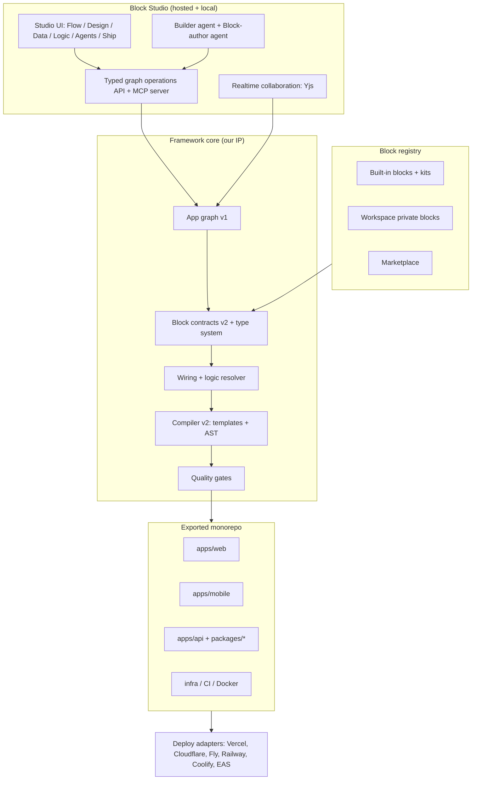

# Block Studio: Upgrade Plan

**From:** a local editor that builds notes-style apps from 19 blocks
**To:** a workspace where technical and non-technical founders build production web and mobile products (SaaS, marketplaces, social, messaging, video, AI-agent products), export code a principal engineer would be proud of, and never hit a ceiling.

**Baseline:** `docs/project-overview.md`, snapshot 9 October 2026.
**Companion document:** `docs/studio-ui-ux.md` (UI/UX of the Studio itself).
**Guiding rule:** *Reuse before build.* Every capability below names the open-source project we adopt, wrap, or learn from before we write anything ourselves.

---

## Contents

0. [Read this first: what "no limits" actually means](#0-read-this-first-what-no-limits-actually-means)
1. [Where we are today (honest baseline)](#1-where-we-are-today-honest-baseline)
2. [Product vision and positioning](#2-product-vision-and-positioning)
3. [The reuse-before-build policy](#3-the-reuse-before-build-policy)
4. [Target architecture](#4-target-architecture)
5. [Graph schema v1: from screens to a full application model](#5-graph-schema-v1-from-screens-to-a-full-application-model)
6. [The block system v2](#6-the-block-system-v2)
7. [The component and block library](#7-the-component-and-block-library)
8. [Feature kits (clone-an-app building blocks)](#8-feature-kits-clone-an-app-building-blocks)
9. [Data layer: visual schema, bindings, and APIs](#9-data-layer-visual-schema-bindings-and-apis)
10. [Logic layer: workflows, actions, and expressions](#10-logic-layer-workflows-actions-and-expressions)
11. [Authentication, organizations, and permissions](#11-authentication-organizations-and-permissions)
12. [Payments and billing](#12-payments-and-billing)
13. [Networking: realtime, messaging, calls, notifications](#13-networking-realtime-messaging-calls-notifications)
14. [Media: uploads, images, video](#14-media-uploads-images-video)
15. [AI inside generated apps (agents, RAG, tools)](#15-ai-inside-generated-apps-agents-rag-tools)
16. [The Studio's own AI: builder agent and block-author agent](#16-the-studios-own-ai-builder-agent-and-block-author-agent)
17. [Code generation v2: exports a principal engineer would write](#17-code-generation-v2-exports-a-principal-engineer-would-write)
18. [Round-trip: code ↔ graph](#18-round-trip-code--graph)
19. [Preview, testing, and quality gates](#19-preview-testing-and-quality-gates)
20. [Deploy, hosting, and mobile release](#20-deploy-hosting-and-mobile-release)
21. [Hosted multi-user Studio and collaboration](#21-hosted-multi-user-studio-and-collaboration)
22. [Block marketplace and ecosystem](#22-block-marketplace-and-ecosystem)
23. [Security, compliance, and operations](#23-security-compliance-and-operations)
24. [Business model and cost advantage](#24-business-model-and-cost-advantage)
25. [Roadmap: phases, milestones, acceptance criteria](#25-roadmap-phases-milestones-acceptance-criteria)
26. [Risks and mitigations](#26-risks-and-mitigations)
27. [Open-source reuse index](#27-open-source-reuse-index)

---

## 0. Read this first: what "no limits" actually means

No builder can ship a pre-made block for every possible feature. Lovable and Emergent get "no limits" by having an LLM write arbitrary code on every request: flexible, but slow, expensive, inconsistent, and often broken on the tenth iteration.

Block Studio gets "no limits" through **three layers that always work together**:

1. **A large library of tested blocks and kits** covers the 90% of products that reuse the same patterns (auth, billing, feeds, chat, dashboards, CRUD, uploads, agents). These cost **zero LLM tokens** to assemble and are deterministic.
2. **A block-authoring path** (human or AI) creates a *new* block when the library lacks one. The new block goes through the same contract, tests, and review as built-ins, then becomes reusable forever, for that user and, if shared, for everyone.
3. **Escape hatches**: a typed *Code block* (UI), *Code action* (logic), and *Custom endpoint* (backend) let a developer drop to TypeScript inside the graph without leaving the framework. The compiler treats the code as owned source with declared inputs/outputs.

The core bet: **every LLM-built capability gets promoted into a reusable, deterministic block.** Competitors pay tokens for the same login screen a million times. We pay once.

---

## 1. Where we are today (honest baseline)

From the project overview, already built and verified:

| Strength we keep | Why it matters for the future |
| --- | --- |
| Deterministic compiler (graph → source, hash-stable) | Cheap, repeatable builds; foundation of the cost advantage |
| Manifest contracts (JSON Schema config, ports, `editSurface`, locked fields) | Already the right shape for a block ecosystem |
| Wiring engine (explicit → semantic → next-page → terminal) | Event model generalizes into a logic layer |
| Web (React/Vite) + native (Expo/RN) targets | Dual-target is a real differentiator |
| Element designer with design overrides and actions | Becomes the visual design layer |
| Scoped AI edits with plan fingerprinting, diff review, protected "touched" paths | Safe AI editing is rare and valuable |
| Paper Cloud: Supabase auth, RLS, revisions, entitlements, manual UPI | Proves the "add capability to framework, then reuse" loop |
| Block SDK (scaffold, test, validate) | Seed of the block-author pipeline |
| Audited deterministic ZIPs, 206 unit + 68 browser tests | Quality culture to carry forward |

Gaps that block the vision (from §22 of the overview):

- Fixed text-note data model; no visual schema or general data binding.
- No visual logic (API calls, conditions, business actions).
- No general connectors; only Supabase.
- No nested components; a page is a flat ordered list of blocks.
- Web runtime is a single generated runtime file, not a professionally structured codebase.
- Native cloud features rejected.
- No real payment provider (manual UPI only), no webhooks, no subscriptions.
- No realtime, media pipeline, search, notifications, or AI-in-app blocks.
- AI cannot change topology or create blocks.
- Local single-user Studio; no hosting, collaboration, deploy, or store release.
- No code → graph import.

---

## 2. Product vision and positioning

**One sentence:** Block Studio is a visual, AI-assisted *application compiler*: you describe or design the product, it assembles tested blocks into a full-stack web + mobile app, and you own clean code with no lock-in.

**Who it serves**

| Persona | What they do in Studio | What they must feel |
| --- | --- | --- |
| Non-technical founder | Describes the product, picks a kit, edits visually, connects Stripe/Razorpay, deploys | "I shipped a real product, not a prototype" |
| Technical founder / indie dev | Uses Studio for 80% scaffolding, drops into code blocks, syncs to GitHub | "This saved me weeks and the code is better than mine" |
| Agency / freelancer | Reuses private block libraries across clients | "Every new client is 70% done on day one" |
| Block author | Publishes blocks/kits to the marketplace | "I earn from things I built once" |

**Differentiators vs Lovable / Emergent / Bolt-style tools**

| Axis | LLM-codegen tools | Block Studio target |
| --- | --- | --- |
| Cost per change | Tokens every edit | Zero tokens for supported edits; tokens only for new capabilities |
| Consistency | Varies per generation | Deterministic, versioned, tested blocks |
| Mobile | Mostly web | First-class Expo/React Native from the same graph |
| Backend depth | Often thin | Data model, workflows, jobs, webhooks, RLS, entitlements as first-class |
| Code quality | Grows messy over iterations | Generated from templates + AST; lint/type/test-clean every export |
| Visual understanding | Chat + preview | Node graph of pages, data, logic, services, agents |
| Lock-in | Varies | MIT-style exported monorepo, no runtime dependency on Studio |

---

## 3. The reuse-before-build policy

Every new capability goes through this checklist **before** any implementation work starts. Record the result in an ADR (`docs/adr/NNNN-<capability>.md`).

1. **Search** GitHub, npm, and awesome-lists for an existing project that does ≥70% of the job.
2. **Check license** against the allowlist:
   - ✅ Embed or generate into user code: MIT, Apache-2.0, BSD-2/3, ISC, MPL-2.0 (file-level), 0BSD, Unlicense.
   - ⚠️ Run only as a separate, unmodified service, never generated into user code: AGPL-3.0, GPL.
   - ❌ Reference/learn only: SSPL, BSL/BUSL, Elastic, "Sustainable Use"/fair-code, FSL, source-available commercial licenses.
   - Re-check the license at adoption time; projects relicense.
3. **Check health**: release in the last 6 months, issue response, bus factor, TypeScript types, React 19 / RN New Architecture support.
4. **Decide the integration mode:**
   - **Adopt** (use as a dependency in Studio or in generated apps),
   - **Wrap** (put a block contract / adapter around it),
   - **Vendor** (copy source into the generated app, shadcn-style, so the user owns it),
   - **Learn** (study the design, implement our own).
5. **Prefer adapters**: every external provider sits behind a framework interface (`PaymentProvider`, `StorageProvider`, `AuthProvider`, `LLMProvider`, `RealtimeProvider`, `EmailProvider`) so users can swap providers without regenerating the graph.
6. **Build from scratch only** when nothing passes steps 2–3, or when the capability *is* our core IP (graph schema, wiring engine, compiler, block contract, AI graph operations).

**What is our core IP (build ourselves):** graph schema, block contract, wiring/type system, compiler and codegen templates, AI graph-operation layer, block-author pipeline, quality gates. **Everything else is reused.**

---

## 4. Target architecture



**Key architectural moves**

1. **Graph operations become the only write path.** UI, AI, MCP clients, and CLI all mutate the graph through a typed operation log (`addPage`, `insertBlock`, `wire`, `createEntity`, `addField`, `createFlow`, `setBinding`, …). This gives undo/redo, collaboration, audit, and AI safety from one mechanism. Extend today's `useProject` mutation path and agent `apply` into this.
2. **Split the compiler into "front-end" and "back-ends".** Front-end: validate graph, resolve types, wiring, bindings, flows into an **intermediate representation (IR)**. Back-ends: web, mobile, API, database, infra emitters. New targets (e.g., Next.js vs Vite, Hono vs Fastify) plug in without touching the graph.
3. **Blocks carry multi-target implementations.** One block = manifest + web impl + native impl + server impl + migrations + tests + docs + AI card.
4. **Generated code does not depend on Studio at runtime.** Small, well-named runtime packages (`@app/ui`, `@app/data`) are *vendored* into the export as owned source.

---

## 5. Graph schema v1: from screens to a full application model

Bump `schemaVersion` from `"0"` to `"1"` with an automatic migrator (`packages/manifest/src/migrations/0-to-1.ts`) and tests that every existing example migrates and compiles identically.

### 5.1 Top-level shape

```ts
type AppGraphV1 = {
  schemaVersion: "1";
  app: AppMeta;                 // name, slug, version, targets: ("web"|"ios"|"android")[]
  theme: DesignTokens;          // full token set, not just 3 colors (§7.2)
  pages: Page[];                // routes, layouts, guards, params
  components: ComponentNode[];  // nested UI tree (replaces flat blocks list)
  data: DataModel;              // entities, relations, policies, seeds (§9)
  flows: Flow[];                // logic graphs: triggers → steps (§10)
  services: ServiceBinding[];   // configured providers: stripe, s3, openai, livekit…
  agents: AgentDef[];           // in-app AI agents (§15)
  env: EnvVarDecl[];            // declared env vars (names + scope, never values)
  i18n?: Locales;
  extensions?: Record<string, unknown>; // namespaced by block package
};
```

### 5.2 Nested component tree

Today a page is an ordered list of blocks. v1 introduces a **tree**: layout primitives (Stack, Grid, Split, Tabs, Sheet, Modal, ScrollView) contain blocks, which can contain **slots** filled by other blocks. Reuse:

- **Puck** (MIT) data model and editor concepts: zones/slots, field definitions, `resolveData`. Evaluate using Puck directly for the in-page Design mode, rendering our blocks as Puck components. Puck outputs plain JSON and is "just a React component", which fits our graph-as-JSON approach.
- **Craft.js** (MIT) as a fallback reference for node-tree editing.
- Layout engine: CSS flex/grid on web; **Yoga** semantics on native. Keep a shared layout subset that maps 1:1.

### 5.3 Pages and routing

- Routes with params (`/post/:id`), nested layouts, guards (`requiresAuth`, `requiresPlan:pro`, `requiresRole:admin`), redirects, deep links.
- Web: **TanStack Router** (MIT) for Vite, or **Next.js App Router** when the user picks SSR/SEO. Mobile: **Expo Router** (MIT) so web and native share a file-based route mental model.
- Lanes become real navigators: stack, tabs, drawer, modal.

### 5.4 Type system for ports

Today payload compatibility covers a JSON Schema subset. v1:

- Every port and binding has a JSON Schema type; the resolver uses **Ajv** (already used) plus a structural subtyping check.
- Introduce named types from the data model (`Entity<Post>`, `List<Entity<Post>>`, `Ref<User>`), so a `PostList` block can only bind to `Post`-shaped data.
- Port color/shape in the UI comes from type category (see UI doc).

### 5.5 Migration and versioning

- Each block version declares a `migrate(fromVersion, config)` function. The registry runs migrations on graph load and records them in the operation log.
- Graph files gain `lockfile` semantics: `blockfw.lock.json` pins resolved block versions + content hashes for reproducible compiles.

---

## 6. The block system v2

### 6.1 Block categories

| Category | Examples | Has UI | Has server | Has data |
| --- | --- | --- | --- | --- |
| **Primitive** | Text, Button, Image, Icon, Input, Select, Divider, Avatar, Badge | ✅ | – | – |
| **Layout** | Stack, Grid, Split, Tabs, Sheet, Modal, Drawer, Card, ScrollArea | ✅ | – | – |
| **Composite UI** | DataTable, Form, Kanban, Calendar, Chart, Carousel, Command menu | ✅ | – | binds |
| **Section** | Hero, Pricing, FAQ, Testimonials, Footer, Feature grid, CTA | ✅ | – | – |
| **Feature module** | Chat thread, Social feed, Video player, Comments, Stories, Checkout | ✅ | ✅ | ✅ |
| **Data** | Entity, Query, Mutation, Collection, Seed, Search index | – | ✅ | ✅ |
| **Logic node** | Trigger, Condition, Loop, HTTP call, Transform, Delay, Code action | – | ✅ | – |
| **Integration** | Stripe, Razorpay, Resend, S3/R2, Twilio, Slack, Google, Webhook-in | optional | ✅ | optional |
| **AI** | Chat UI, Agent, Tool, RAG source, Embeddings, Moderation, Evaluator | optional | ✅ | ✅ |
| **Infra** | Cron, Queue, Rate limit, Cache, Feature flag, Env var, Domain | – | ✅ | – |

### 6.2 Block package layout

A block is an npm-style package, also distributable through a **shadcn-compatible registry** (MIT; JSON registry schema with files + dependencies). Reusing that registry format means the ecosystem's existing tooling and mental model ("copy source into your project") apply.

```text
blocks/chat.thread/
  block.json              # manifest: id, version, category, targets, ports, config schema,
                          # editSurface, locked, services required, data requirements, license
  web/ChatThread.tsx      # web implementation (React, shadcn/Radix + Tailwind)
  native/ChatThread.tsx   # native implementation (RN + NativeWind / RN Reusables)
  shared/logic.ts         # platform-agnostic state/logic hooks
  server/routes.ts        # server handlers (Hono) – optional
  server/flows.ts         # flow steps the block contributes – optional
  data/schema.ts          # Drizzle entities the block contributes – optional
  data/migrations/*.sql   # generated, reviewed
  data/policies.sql       # RLS / authorization – optional
  tests/*.test.ts(x)      # unit + render + contract tests
  stories/*.stories.tsx   # Storybook stories per variant
  docs/README.md          # human docs
  card.md                 # ≤300-token AI card (existing concept)
  preview.png             # palette thumbnail (auto-generated)
```

### 6.3 Contract additions (extend `@blockfw/manifest`)

- `targets`: which of web / ios / android / server are implemented. Compiler rejects unsupported combinations with a clear message (keep today's "reject rather than mock" rule).
- `requires`: services (`payments`, `storage`, `realtime`, `llm`), data entities (by shape), other blocks, env vars.
- `provides`: entities, routes, flow steps, events, slots.
- `slots`: named child insertion points with allowed categories.
- `bindings`: which config fields can bind to data/expressions vs. static values.
- `designTokens`: which theme tokens the block consumes (so theme edits restyle everything consistently).
- `permissions`: what it reads/writes, used for security review and marketplace badges.
- `stability`: `experimental | beta | stable`, shown in the palette.

### 6.4 Renderer strategy: stop emitting source strings for everything

Today blocks render source via string templates and the web runtime is generated. v2:

- **Block implementations are real `.tsx` files** that are type-checked, linted, unit-tested, and Storybook-rendered *in the framework repo*.
- At compile time, the compiler **vendors** the block's files into the export and generates only the *composition* code (pages, wiring, bindings, providers) using **ts-morph** (MIT) / Babel AST builders, then formats with **Prettier** or **Biome**.
- Config becomes props, not string interpolation. Design overrides become a typed `style`/`className` layer, not JSX surgery (retire the native JSX transformation path once all blocks are migrated).

This one change is what makes exported code look human-written.

### 6.5 Cross-platform UI strategy

Options evaluated (pick in an ADR, recommended first):

1. **Recommended:** separate web (shadcn/ui + Radix + Tailwind v4) and native (React Native Reusables / NativeWind, both MIT) implementations sharing `shared/logic.ts` hooks and one design-token source. Best-in-class output per platform; this is how strong teams actually ship.
2. **Tamagui** (MIT): one component set for web + native with an optimizing compiler. Fewer files, but output looks less like "normal" React to most developers.
3. **gluestack-ui v2** (MIT): universal components with NativeWind.
4. **react-native-web only**: simplest, but weakest web output (SEO, semantics).

Tokens: a single `tokens.json` in **W3C Design Tokens** format compiled with **Style Dictionary** (Apache-2.0) into Tailwind config (web) and a TS theme (native).

---

## 7. The component and block library

### 7.1 Sources to reuse (do not hand-build these)

| Need | Reuse | Mode |
| --- | --- | --- |
| Web primitives & composites | **shadcn/ui** + **Radix UI** (MIT) | Vendor into export |
| Extra web blocks/sections | shadcn registry community blocks, **Origin UI**, **Magic UI**, **Aceternity**-style sections (check each license) | Wrap as section blocks |
| Data table | **TanStack Table** (MIT) | Wrap |
| Forms + validation | **React Hook Form** (MIT) + **Zod** (MIT) | Wrap; Zod schemas generated from entity model |
| Charts | **Recharts** (MIT) web; **Victory Native** (MIT) native | Wrap |
| Rich text | **Tiptap** core (MIT) or **Lexical** (MIT) web; **10tap-editor** (MIT, check) native | Wrap |
| Drag & drop in apps | **dnd-kit** (MIT) | Wrap (Kanban, sortable lists) |
| Calendar/scheduling UI | **react-big-calendar** (MIT), **FullCalendar** standard (MIT) | Wrap |
| Icons | **Lucide** (ISC) | Adopt |
| Animation | **Motion** (MIT) web; **Reanimated** (MIT) native | Adopt |
| Native primitives | **React Native Reusables** (MIT), **NativeWind** (MIT) | Vendor |
| Bottom sheets / gestures | **@gorhom/bottom-sheet** (MIT), **Gesture Handler** (MIT) | Adopt |
| Lists at scale | **FlashList** (MIT) native; **TanStack Virtual** (MIT) web | Adopt |
| Maps | **MapLibre** (BSD) web/native | Wrap |
| Emails | **React Email** (MIT) | Wrap as email-template blocks |

### 7.2 Theme and design tokens

Replace the 3-color theme with a complete token system: color scales (primary/neutral/success/warning/danger, light + dark), typography scale, spacing, radius, shadows/elevation, motion durations. The profile cascade (6 questions) now writes into tokens, and a **theme generator** derives full scales from one brand color (reuse **Radix Colors** scales or **tints.dev**-style algorithms; or `@material/material-color-utilities`, Apache-2.0).

### 7.3 Library size targets

| Milestone | Blocks | Kits |
| --- | --- | --- |
| Phase 1 | 80 (primitives, layout, composites, sections) | SaaS starter |
| Phase 2 | 160 (+ data, logic, integrations) | SaaS, Marketplace, Booking, CRM |
| Phase 3 | 250+ (+ realtime, media, AI) | Chat app, Social feed, Video platform, LMS, AI assistant |
| Phase 4 | 500+ incl. marketplace | Community kits |

Every block ships with: both target implementations (or an explicit "web-only"/"native-only" flag), ≥2 variants, Storybook stories, render tests, a11y test (axe), AI card, and a palette thumbnail.

---

## 8. Feature kits (clone-an-app building blocks)

A **kit** is a curated set of blocks + data entities + flows + pages + seed data that together implement a product pattern. Kits are how a founder "clones WhatsApp" in minutes. Each kit is a graph fragment that can be merged into any app.

| Kit | Contents | Main reuse |
| --- | --- | --- |
| **SaaS** | Landing sections, auth, orgs/teams, invites, roles, billing, settings, admin, audit log, onboarding | Better Auth, Stripe/Razorpay adapters, shadcn blocks |
| **Messaging (WhatsApp-like)** | Conversations, 1:1 + groups, typing, read receipts, media messages, push, presence, voice/video call | Realtime adapter, LiveKit, Expo Notifications, Yjs optional |
| **Social feed (Instagram-like)** | Profiles, follow graph, posts with media, stories, likes, comments, explore, notifications, moderation | Media pipeline, fan-out flows, search |
| **Video (YouTube-like)** | Channels, upload, transcoding to HLS, player, comments, subscriptions, watch history, recommendations | Mux / Cloudflare Stream adapter or self-hosted ffmpeg → HLS, Vidstack, expo-video |
| **Marketplace** | Listings, search/filters, cart, checkout, orders, seller payouts, reviews | Medusa (MIT) as optional commerce backend, Stripe Connect / Razorpay Route |
| **Booking** | Services, availability, slots, calendar sync, reminders, payments | Cal.com is AGPL → learn only; build availability engine with `rrule` (BSD) |
| **CRM / internal tools** | Tables, kanban, record detail, activity, imports, role-based admin | TanStack Table, dnd-kit |
| **LMS** | Courses, lessons, video, quizzes, progress, certificates | Video kit, existing quiz block |
| **AI assistant product** | Chat UI, agent with tools, RAG over uploads, usage metering, billing by credits | AI SDK, pgvector, metering flows |
| **Notes (existing Paper)** | Keep as a kit; migrate to new data layer | Current blocks |

**Clone-from-reference flow (Phase 3):** user provides URLs/screenshots → builder agent maps UI regions to library blocks (vision model + block cards), maps features to kits, produces a *proposal graph* with a coverage report ("92% covered by existing blocks; 3 new blocks needed: X, Y, Z") → user approves → block-author agent creates the missing blocks (§16.3).

---

## 9. Data layer: visual schema, bindings, and APIs

### 9.1 Visual data model (Entity Spine v2)

Upgrade `@blockfw/spine` from "SQL/types scaffold" to the authoritative data model:

- Entities, fields (add `enum`, `json`, `file`, `geo`, `vector`, `richtext`, `money`, `email`, `url`, `phone`), relations (1:1, 1:N, N:M with join entities), indexes, unique constraints, soft delete, timestamps, ownership.
- **Policies** per entity: `owner`, `org member`, `role`, `public read`, custom expression. Compiled to Postgres **RLS** *and* to API-layer checks (defense in depth, like Paper Cloud today).
- **Seeds** and **fixtures** for previews.
- Schema edits produce **migrations** with a diff preview, never silent destructive changes.

**Reuse:**
- **Drizzle ORM + drizzle-kit** (Apache-2.0): generated schema files and migration generation. Exported code uses Drizzle, which developers already know.
- **Zod** + `drizzle-zod`: validation schemas generated from entities, shared by forms and API.
- **pgvector** (PostgreSQL License) for vector fields.
- Database targets via adapters: **Supabase** (existing), plain **Postgres** (Neon, RDS, self-hosted), **PocketBase** (MIT) for tiny apps (optional), **SQLite/Turso** for local-first.

### 9.2 Bindings

Any bindable config field can be static, bound to data, or bound to an expression:

```json
{ "title": { "bind": "query:currentPost.title" },
  "items": { "bind": "query:feed", "map": { "image": "$.media[0].url" } },
  "visible": { "expr": "user.plan == 'pro'" } }
```

- Queries are graph nodes (`Query<Post>` with filters, sort, pagination, includes) compiled to typed server functions + **TanStack Query** (MIT) hooks on the client.
- Mutations likewise, with optimistic updates (generalize Paper's revision/optimistic logic).

### 9.3 Generated API

- **Hono** (MIT) server: runs on Node, Bun, Cloudflare Workers, Vercel, Deno. Replaces the hand-written `server/index.mjs`.
- Typed RPC via **oRPC** or **tRPC** (MIT) for the app's own clients, plus an **OpenAPI** document (via `hono-openapi` / `zod-openapi`) for third parties.
- Optional **REST CRUD** per entity, auto-generated with pagination/filtering and policy checks.

### 9.4 Local-first and offline (Phase 3)

For mobile apps that need offline: evaluate **ElectricSQL** (Apache-2.0), **PowerSync** (check license), **Zero** (check license), **Legend-State** (MIT). Pick one adapter; keep the data block contract the same so blocks don't care.

### 9.5 Search

`SearchIndex` block: Postgres full-text by default; **Meilisearch** (MIT) adapter for typo-tolerant/faceted search; pgvector for semantic search. Index sync is a generated flow.

### 9.6 Import existing data/APIs

- **OpenAPI import**: paste a spec → generate typed client (**openapi-typescript** / **Orval** / **Hey API**, MIT) → each operation becomes an Integration block usable in flows and bindings.
- **Database introspection**: `drizzle-kit pull` to import an existing Postgres schema into the visual data model.

---

## 10. Logic layer: workflows, actions, and expressions

### 10.1 Flows

A **Flow** is a node graph: `Trigger → Steps → (branches, loops) → Outputs`. Today's event wires become one kind of trigger.

| Triggers | Steps |
| --- | --- |
| UI event (button, form submit, element action) | Query / insert / update / delete |
| Data change (row inserted/updated) | Condition (if/switch), loop (for-each), parallel |
| Schedule (cron) | HTTP request, integration call (Stripe, Resend…) |
| Webhook in (Stripe, Razorpay, GitHub, custom) | Transform (map/filter), set variable |
| Auth event (signup, login) | Send email / push / SMS |
| Payment event (paid, failed, canceled) | Call agent / LLM, run tool |
| Agent tool call | Delay / wait for event / human approval |
| Manual / admin action | Code action (typed TypeScript escape hatch) |

**Compilation:** flows compile to **plain TypeScript functions** in `packages/flows`, one file per flow, readable and testable. Client-side flows (navigate, show toast) compile into event handlers; server-side flows into Hono routes or job handlers.

**Durable execution** (retries, delays, long waits): adapter interface with implementations for **Trigger.dev** (Apache-2.0), **graphile-worker** or **pg-boss** (MIT, Postgres-backed, zero extra infra), and **Inngest** (check license of the self-hosted server before generating code against it). Default: pg-boss/graphile-worker so a fresh export runs with only Postgres.

**Reuse for the editor:** the flow canvas uses the same **React Flow / xyflow** (MIT) we already use. Study **n8n** (fair-code, learn only), **Node-RED** (Apache-2.0), **Flowise** (Apache-2.0) and **Langflow** (MIT) for node UX and execution-trace display; do not embed n8n.

### 10.2 Expressions

A small, safe, typed expression language for bindings, conditions, and transforms:

- Parse with **jsep** (MIT) restricted to a whitelist (member access, operators, ternary, a function library like `now()`, `format()`, `len()`), type-check against the graph's type system, compile to TS.
- Alternative: **CEL** (`cel-js`, check license) if we want a standard with formal semantics.
- Never `eval`. Expressions compile to code at build time.

### 10.3 Debugging

- **Flow run traces** in Studio (step inputs/outputs, timing, errors), like n8n/Langflow execution views.
- **Step-through** in preview with mocked services.
- Generated flows emit **OpenTelemetry** spans so the same traces work in production.

---

## 11. Authentication, organizations, and permissions

Replace bespoke auth with an adapter whose default is **Better Auth** (MIT):

- Email/password with verification, magic links, OTP, social providers (Google, Apple, GitHub…), passkeys, 2FA, sessions, rate limiting.
- **Organizations plugin** for multi-tenant SaaS: orgs, members, invites, roles.
- Expo integration for native auth, which closes today's "cloud native export rejected" gap.

Alternative adapters: **Supabase Auth** (existing; keep for Paper Cloud), **Clerk** (commercial, wrap only), **Ory Kratos / Keycloak** (Apache-2.0) for enterprise self-host.

**Authorization:** roles + permissions declared in the graph; compiled to API middleware + RLS. For complex rules, adapter for **CASL** (MIT) on the API side.

**Blocks:** SignIn, SignUp, ForgotPassword, ResetPassword, VerifyEmail, SocialButtons, Passkey, TwoFactor, OrgSwitcher, InviteMembers, MembersTable, RoleEditor, SessionList, AccountSettings, DeleteAccount (GDPR).

---

## 12. Payments and billing

Generalize Paper Cloud's entitlements into a **Billing engine** that any app uses, with provider adapters.

### 12.1 Model

```text
Product → Price (one-time | recurring | usage | credits) → Checkout → Payment/Subscription
        → Entitlement (features, limits, quotas, expiry) → Enforcement (UI gates + API + DB)
```

Entitlements are declared in the graph (`plan.pro: { notes: 10000, aiCredits: 500, features: [export] }`) and enforced in three places, exactly as Paper does today, but generically.

### 12.2 Provider adapters

| Provider | Use case | Notes |
| --- | --- | --- |
| **Stripe** | Global cards, subscriptions, Checkout, Billing Portal, Connect | Official SDK (MIT); webhooks generated with signature verification |
| **Razorpay** | India: UPI, cards, netbanking, subscriptions, Route for marketplaces | Official SDK; UPI AutoPay for recurring |
| **Cashfree / PhonePe PG** | India alternatives | Adapter |
| **Paddle / Lemon Squeezy** | Merchant-of-record (tax handled) | Adapter |
| **RevenueCat** | iOS/Android in-app purchases (required by store rules for digital goods) | SDK (MIT); service commercial |
| **Hyperswitch** (Apache-2.0) | Optional open-source payment orchestrator for routing across providers | Run as separate service |
| **Manual UPI** | Keep existing flow as a "no-provider" testing/bootstrapping option | Existing |

### 12.3 What gets generated

- Pricing table block bound to products/prices; checkout block; billing portal link; invoices list; plan badge; upgrade prompts on limit hit.
- Webhook endpoints per provider with idempotency keys, signature verification, retries, and an audit log (reuse Paper's audited idempotent pattern).
- Usage metering flows (for AI credits, API calls) with a `usage_events` table and periodic aggregation.
- Reconciliation job comparing provider state with local entitlements.

**Reuse/learn:** **Lago** (AGPL) as a reference for usage-based billing design; run as a separate service only if a user explicitly wants it.

---

## 13. Networking: realtime, messaging, calls, notifications

### 13.1 Realtime adapter

`RealtimeProvider` interface: channels, presence, broadcast, row-change subscriptions.

| Implementation | When |
| --- | --- |
| **Supabase Realtime** | Already using Supabase |
| Self-hosted **WebSocket** server in the generated API (Hono WS / **uWebSockets.js** (Apache-2.0) / **Socket.IO** (MIT)) + Redis/Postgres pub-sub | Default self-host |
| **Centrifugo** (Apache-2.0) | High-scale fan-out service |
| **PartyKit / PartyServer** (MIT) | Cloudflare deployments |
| **Yjs** (MIT) + **Hocuspocus** (MIT) | Collaborative documents (Notion/Figma-style features) |

### 13.2 Messaging kit specifics

- Messages table with partitioning by conversation, cursor pagination, delivery/read receipts, typing indicators via presence, attachment messages through the media pipeline.
- **End-to-end encryption** option: reuse **libsignal** client libraries (AGPL → separate-service/consult) or **Matrix** (Synapse AGPL, server-only; Matrix client SDKs Apache-2.0). Default: transport encryption + at-rest encryption; E2EE is an advanced, clearly labeled kit.

### 13.3 Voice and video calls

**LiveKit** (Apache-2.0) server + React and React Native SDKs: 1:1 and group calls, screen share, recording, and LiveKit Agents for AI voice agents. Blocks: CallButton, CallScreen, VideoGrid, IncomingCallSheet.

### 13.4 Notifications

- Push: **Expo Notifications** + FCM/APNs; web push via standard Push API.
- Orchestration (preferences, digests, in-app inbox, multi-channel): **Novu** (MIT core) adapter, or a built-in lightweight `notifications` table + flows for small apps.
- Email: **React Email** templates + providers (Resend, Postmark, SES, SMTP via **Nodemailer**, MIT).
- SMS/WhatsApp Business: Twilio / Gupshup / MSG91 integration blocks.

---

## 14. Media: uploads, images, video

- Uploads: **Uppy** + **tus** (MIT) resumable uploads on web; `expo-image-picker`/`expo-document-picker` on native; presigned URLs to **S3-compatible storage** (AWS S3, Cloudflare R2, Backblaze B2, MinIO (AGPL, run as service), Supabase Storage).
- Images: on-the-fly transforms via provider (R2 Images, Supabase transforms) or **imgproxy** (MIT) service; **sharp** (Apache-2.0) for server processing; `expo-image` on native.
- Video: adapter for **Mux** / **Cloudflare Stream** (managed) or self-hosted **ffmpeg** → HLS jobs on the queue; playback with **Vidstack** (MIT) web and **expo-video** native.
- Moderation hooks: image/text moderation step available to flows (provider or open model).

---

## 15. AI inside generated apps (agents, RAG, tools)

This is the "apps with AI agents" requirement: the founder's *end users* get AI features.

### 15.1 Building blocks

| Block | Implementation |
| --- | --- |
| Chat UI (streaming, tool-call display, attachments) | **Vercel AI SDK** UI hooks (Apache-2.0); **assistant-ui** (MIT) components on web |
| LLM call step (flow) | AI SDK core with provider adapters (OpenAI, Anthropic, Google, Mistral, Groq, local via Ollama/OpenAI-compatible) |
| Agent (multi-step, tools, memory) | AI SDK agent loop; evaluate **Mastra** (check license per package) or **LangGraph.js** (MIT) for complex graphs |
| Tools | Any flow or integration block can be exposed as a tool with its typed input schema; **MCP** client support so agents can use external MCP servers |
| RAG source | Upload/crawl → chunk → embed → pgvector; retrieval step with filters by user/org |
| Structured extraction | Zod schema + `generateObject` |
| Voice agent | LiveKit Agents |
| Guardrails & moderation | Input/output check steps; PII redaction |
| Evals | **promptfoo** (MIT) test suites generated per agent |
| Observability | **Langfuse** (MIT core) or OpenTelemetry GenAI spans |
| Metering | Token usage → `usage_events` → billing credits (§12) |

### 15.2 Agents in the graph

An `AgentDef` has: model + fallback, system prompt (templated with bindings), tools (references to flows/integrations), memory (none / conversation / long-term vector), limits (max steps, max tokens, per-user quotas), and an eval suite. The Agents canvas (see UI doc) shows agent → tools → data sources as a node graph.

---

## 16. The Studio's own AI: builder agent and block-author agent

### 16.1 Principles kept from today

Scoped context, typed operations only, diff review, plan fingerprints, protected touched paths, undo. These are what make AI editing safe; extend them rather than replacing them with free-form code generation.

### 16.2 Builder agent (assembles from existing blocks)

- **Inputs:** natural language, PRD, screenshots/URLs, current graph summary, block cards (≤300 tokens each, retrieved by semantic search over the registry, never the whole library).
- **Outputs:** a *plan* of typed graph operations (add pages, insert blocks, define entities, create flows, wire events, set bindings, configure services).
- **Process:** plan → validate against contracts (dry-run compile) → show diff on canvas (ghost nodes) → user approves in batches → apply → run quality gates → report.
- **Model routing:** cheap model for small edits, strong model for planning; usage shown per action. Provider-agnostic through the AI SDK; keep the existing ChatGPT-account connection as one provider.
- **MCP server:** expose graph operations as an MCP server (`@modelcontextprotocol/sdk`, MIT) so Claude Code, Cursor, and other agents can build apps through Studio's safe operations, a strong distribution channel.

### 16.3 Block-author agent (creates new blocks when needed)

Triggered when the builder's coverage report finds no suitable block.

1. **Spec**: agent writes a block manifest (ports, config schema, targets, data/service requirements). User reviews the contract first, which is cheap to read and catches misunderstandings early.
2. **Search**: check the marketplace and shadcn-compatible registries for an existing component to wrap (reuse-before-build applies to the agent too).
3. **Implement** in an isolated sandbox: **E2B** (Apache-2.0) or a Docker sandbox; scaffold via existing `sdk scaffold`.
4. **Verify automatically**: typecheck, lint, `sdk test`, render each variant in Storybook, Playwright screenshot, axe a11y check, security lint (Semgrep rules), bundle size.
5. **Visual self-check**: compare screenshot against the reference image (if cloning) with a vision model; iterate within a capped budget.
6. **Review**: user sees the block card, stories, and test results; approves → block is published to the **workspace private registry** at `0.1.0-experimental`.
7. **Promote**: after real usage and passing gates, maintainers can promote it to the public library or marketplace.

### 16.4 Other agent roles

- **Reviewer agent:** reviews diffs for security (policy holes, secrets, unsafe expressions) and UX consistency.
- **Debugger agent:** reads flow traces, preview console, and failing tests; proposes graph ops or code-block fixes.
- **Migration agent:** upgrades graphs when block major versions change.

### 16.5 Token-efficiency targets

- Assembling from existing blocks: target <20k tokens for a 10-page app.
- Creating a new block: budget shown up front; hard cap per attempt.
- Track cost per app in a benchmark (extend `@blockfw/benchmark` with a "clone app X" suite and compare against a baseline coding agent on the same prompts).

---

## 17. Code generation v2: exports a principal engineer would write

### 17.1 Exported monorepo layout

```text
my-app/
  apps/
    web/                    # Vite + React + TanStack Router (or Next.js App Router if SSR chosen)
      src/routes/           # one file per page, generated composition only
      src/features/<kit>/   # feature folders: components, hooks, api
      src/components/ui/    # vendored shadcn primitives
      src/lib/              # api client, auth client, utils
    mobile/                 # Expo + Expo Router
      app/                  # routes mirror web where possible
      src/features/<kit>/
      src/components/ui/    # vendored RN Reusables / NativeWind
    api/                    # Hono server
      src/routes/
      src/middleware/       # auth, rate limit, errors, logging
      src/webhooks/
      src/jobs/
  packages/
    db/                     # Drizzle schema, migrations, seeds, policies
    flows/                  # compiled logic flows, one file each, with tests
    validation/             # Zod schemas shared by web, mobile, api
    api-client/             # typed client (oRPC/tRPC + OpenAPI)
    ui-tokens/              # Style Dictionary output
    config/                 # tsconfig, eslint, tailwind presets
    ai/                     # agents, tools, prompts, evals (if used)
  infra/
    docker/ compose.yaml    # postgres, redis, api, web
    github/workflows/       # CI: typecheck, lint, test, build, migrate check
  docs/
    ARCHITECTURE.md  SETUP.md  DEPLOY.md  DATA-MODEL.md  FLOWS.md  ADRs/
  .env.example  turbo.json  package.json  pnpm-workspace.yaml  README.md
```

Only generate the parts the graph uses: a static landing page should export as a single small Vite app, not a monorepo (continue today's "local exports omit cloud code" discipline).

### 17.2 Tooling choices (all reused)

- Monorepo: **pnpm workspaces** + **Turborepo** (MIT).
- Lint/format: **Biome** (MIT/Apache) or ESLint + Prettier (configurable); strict TypeScript.
- Tests: **Vitest** (MIT), **Testing Library** (MIT), **Playwright** (Apache-2.0); generated smoke tests per page and per flow.
- Env validation: **@t3-oss/env-core** (MIT) with Zod.
- Logging: **pino** (MIT); errors: Sentry SDK or OpenTelemetry exporters.
- Codegen: **ts-morph** (MIT) for AST construction; **Plop** (MIT) patterns for file templates; **Prettier** for final formatting.

### 17.3 Code quality rules enforced by the compiler

- No generated file over ~300 lines; split by feature.
- Readable names from the graph (`PostCard`, `useFeedQuery`), never `block_7f3a`.
- No dead code, no unused deps (keep current unused checks; add **knip**, ISC).
- Comments only where intent isn't obvious; each generated file has a one-line header pointing to the graph node it came from.
- Consistent error handling, loading and empty states for every data-bound block.
- Accessibility: semantic elements, labels, focus order, contrast checked against tokens.
- Deterministic output: keep canonical JSON + SHA-256 hashing.

### 17.4 Golden exports

Maintain `examples/*` golden apps (SaaS, chat, feed, video, marketplace). CI compiles each, runs the full quality gate, and diffs against committed snapshots. A human "principal engineer review" checklist is run on each golden export every release.

---

## 18. Round-trip: code ↔ graph

Today, edits in exported code cannot come back into Studio. Plan:

1. **Owned regions** (Phase 2): generated files mark *generated* vs *user-owned* sections; user code in Code blocks, custom endpoints, and `src/custom/**` is never overwritten. Regeneration merges with **git three-way merge** semantics.
2. **GitHub sync** (Phase 2): Studio pushes exports to a branch and opens PRs; developers edit code in their IDE; Studio reads back owned regions. Use the GitHub App API via **Octokit** (MIT).
3. **Structured import** (Phase 3): ts-morph parser recognizes compositions it generated (pages, props) and maps safe edits (prop values, block order) back to graph operations. Anything unrecognized stays as owned code and appears in Studio as a Code block node.
4. **Import foreign projects** (Phase 4, research): analyze an existing React/Expo codebase, wrap its components as private blocks automatically (manifest inferred from props/TypeScript types via **react-docgen-typescript**, MIT).

---

## 19. Preview, testing, and quality gates

### 19.1 Preview

- **Web:** keep the existing `/api/run` bundling; move to an in-browser bundler for hosted Studio: **Sandpack** (Apache-2.0) or **esbuild-wasm** (MIT). Avoid WebContainers unless commercially licensed.
- **Full-stack preview:** each app gets an ephemeral preview environment (API + Postgres branch) via Neon branching / Supabase branching / a container per preview.
- **Native:** QR code to open in **Expo Go** or a development build via a tunnel; **Expo Snack** runtime for quick in-browser native preview; device frames for react-native-web previews.
- **Seeded data:** previews use fixtures from the data model; "Connected" mode uses real services with a clear banner (existing behavior).

### 19.2 Quality gates (run on every export and every AI-applied change)

| Gate | Tool |
| --- | --- |
| Graph validity, types, wiring, unbound required inputs | Our validator |
| TypeScript strict, lint, format | tsc, Biome/ESLint |
| Unit + flow tests | Vitest |
| E2E smoke per page | Playwright |
| Accessibility | **axe-core** (MPL-2.0) |
| Performance budget | Lighthouse CI (Apache-2.0), bundle size check |
| Security | **Semgrep** OSS rules, **gitleaks** (MIT), **osv-scanner** (Apache-2.0), RLS policy coverage check (every entity has a policy) |
| Migrations safe | drizzle-kit check + destructive-change warning |
| Visual regression (library) | Storybook + Playwright screenshots |

Studio shows gate results as a **health score** with one-click fixes where possible.

---

## 20. Deploy, hosting, and mobile release

### 20.1 Deploy adapters ("Ship" mode)

| Target | Fits | Mechanism |
| --- | --- | --- |
| Vercel / Netlify | Static + serverless web | Their APIs/CLIs |
| Cloudflare (Pages + Workers + R2 + D1/Hyperdrive) | Edge, cheap | Wrangler |
| Fly.io / Railway / Render | Container API + Postgres | Their APIs + Dockerfile |
| Self-host | VPS | **Coolify** (Apache-2.0) or **Dokploy** (check license) templates; Docker Compose |
| Database | Managed Postgres | Supabase / Neon provisioning via their APIs (OAuth) |

Flow: connect provider (OAuth) → Studio provisions DB, sets env vars from the declared env list (user enters secrets into the provider or Studio's encrypted vault, never into the graph) → run migrations → deploy → health check that tests **service readiness**, not just `/healthz` (fixes a gap noted in the overview) → custom domain + HTTPS.

### 20.2 Mobile release

- **EAS Build / Submit** (Expo, service) for signed binaries and store submission; or local `expo prebuild` + Fastlane (MIT) for self-managed.
- Store checklist generator: icons, splash, screenshots (Playwright/Maestro captured), privacy labels from declared data usage, in-app-purchase compliance warnings when digital goods use non-store payments.
- OTA updates via EAS Update, or self-hosted **expo-updates** server.
- Native E2E tests: **Maestro** (Apache-2.0).

### 20.3 Environments

dev / preview (per branch) / staging / production, each with its own env values and database. Promotions run migrations with approval.

---

## 21. Hosted multi-user Studio and collaboration

Today Studio is a loopback server. To sell it, it must run as a hosted product (keeping the local mode for developers).

- **Backend:** Hono API, Postgres (Drizzle), Better Auth with organizations for Studio's own accounts, object storage for assets, job queue for compiles/agents.
- **Workspaces → Projects → Branches.** Graph versions stored as operation logs + periodic snapshots; branches and merges of graphs (like Git, with graph-aware conflict resolution).
- **Realtime collaboration:** **Yjs** (MIT) document per project, synced through **Hocuspocus** (MIT); presence cursors, selection, follow mode. Liveblocks (commercial) is the managed alternative.
- **Comments** pinned to nodes, elements, or canvas positions; mentions; resolve.
- **Roles:** owner, admin, editor, designer (design only), viewer, client (comment only).
- **Isolation:** compiles and agent sandboxes run in per-job containers (E2B / Firecracker-based) with no access to other tenants.
- Keep **local Studio** (`npx block-studio`) with the same UI, file-based storage, and optional cloud sync.

---

## 22. Block marketplace and ecosystem

- Registry service compatible with the shadcn registry JSON format plus our manifest extensions; also installable via CLI (`blockfw add chat.thread`).
- Publishing pipeline runs the same quality gates as built-ins; listings show targets, stability, permissions, license, test status, downloads, and screenshots.
- **Signing/provenance:** Sigstore (Apache-2.0) signatures; lockfile pins content hashes.
- Free and paid blocks/kits; revenue share; private org registries for agencies.
- Templates gallery: full apps (graph + seed data) remixable in one click.

---

## 23. Security, compliance, and operations

- **Secrets:** never in graphs or exports (keep and extend the current audit). Studio vault: envelope encryption with a KMS; per-environment secrets pushed to deploy providers.
- **Generated-app defaults:** HTTPS, secure cookies, CSRF protection, CORS allowlist, rate limiting, input size limits, RLS on every table, audit logs for privileged actions, dependency pinning.
- **Privacy:** data inventory derived from the data model (which fields are PII) → privacy policy draft, data export, and account deletion flows (GDPR/DPDP Act India).
- **Studio security:** SOC 2-style controls roadmap, tenant isolation, sandboxed code execution, audit log, SSO (SAML via Better Auth plugin or Ory/Keycloak).
- **Observability in generated apps:** OpenTelemetry traces/logs, optional Sentry, **PostHog** (MIT core) product analytics block, uptime checks.
- **Feature flags:** **Unleash** (Apache-2.0) or **GrowthBook** (MIT core) adapter; or a simple flags table.

---

## 24. Business model and cost advantage

- **Free:** local Studio, unlimited graph editing, compile/export, community blocks. Like Higgsfield Canvas, which keeps building the graph free and only charges credits when a node actually generates, we charge for compute, not for clicking.
- **Pro:** hosted Studio, previews with databases, deploy integrations, AI credits, private blocks.
- **Team / Agency:** collaboration, roles, private registry, client seats, white-label exports.
- **Marketplace:** revenue share on paid blocks/kits.
- **Credits shown before spending:** every AI action shows estimated cost; assembling from existing blocks costs nothing.

Track per app: tokens spent, % of graph built from existing blocks ("reuse ratio"), time to first deploy. These are the marketing numbers against Lovable/Emergent.

---

## 25. Roadmap: phases, milestones, acceptance criteria

Durations assume a small team (2–4 engineers + AI assistance). Adjust after Phase 0.

### Phase 0: Foundations (4–6 weeks)

- ADRs for: UI stack (web/native), compiler IR, router choices, durable jobs, auth default, codegen tooling.
- Graph schema v1 + migrator from v0; all 5 existing examples migrate and compile.
- Typed graph-operations API; UI, agent, and CLI all write through it; operation log powers undo/redo.
- Compiler split into front-end (IR) and back-ends; existing outputs unchanged (hash-level tests may be rebaselined once, intentionally).
- Block package format v2; migrate 3 existing blocks as reference (`content.hero`, `data.collection`, `auth.account`).

**Exit criteria:** existing test suites green; new schema documented; one migrated block exports as real vendored `.tsx` files.

### Phase 1: Professional exports + core library (8–10 weeks)

- Monorepo export layout (§17), Turborepo, Biome, Vitest, CI workflow, docs generation.
- Web: shadcn/Radix/Tailwind; native: RN Reusables/NativeWind; tokens via Style Dictionary.
- Nested component tree + slots; Design mode on Puck (or decision to keep own designer).
- 80 blocks (primitives, layout, composites, sections) with stories and tests.
- Migrate all 19 existing blocks to v2.
- New Studio UI shell per `studio-ui-ux.md` (Flow + Design modes).

**Exit criteria:** golden SaaS landing + dashboard app exports; independent senior engineer review rates structure "would merge"; all gates green; Lighthouse ≥90 on golden web app.

### Phase 2: Full-stack (10–12 weeks)

- Data mode: visual schema, relations, policies, migrations (Drizzle), bindings, queries/mutations, generated Hono API + typed client.
- Logic mode: flows, triggers, expressions, durable jobs (pg-boss/graphile-worker), traces.
- Auth: Better Auth with orgs; native auth working (closes the native-cloud gap).
- Payments: Stripe + Razorpay adapters, subscriptions, webhooks, entitlements engine; port Paper Cloud onto it.
- Email (React Email + Resend/SMTP), storage (S3/R2 + Uppy), OpenAPI import.
- GitHub sync with owned regions.
- Deploy adapters: Vercel, Cloudflare, Railway/Fly, Docker/Coolify; Supabase/Neon provisioning.
- Kits: SaaS, Marketplace, Booking, CRM. 160 blocks.

**Exit criteria:** a non-technical tester builds a paid multi-tenant SaaS (auth, orgs, Stripe subscription, CRUD, emails) and deploys it to a public URL in under 2 hours with zero manual code; same graph exports a working Expo app with login and data.

### Phase 3: Realtime, media, AI, and agents (10–12 weeks)

- Realtime adapter, presence, Yjs documents, LiveKit calls, push notifications (Novu adapter).
- Media pipeline: images, video upload → HLS, players.
- AI-in-app: chat UI, agents, tools, RAG/pgvector, evals, metering.
- Builder agent v2 (multi-step plans across all modes), MCP server, block-author agent with sandbox verification.
- Clone-from-reference flow with coverage report.
- Kits: Messaging, Social feed, Video, LMS, AI assistant. 250+ blocks.
- Hosted Studio beta with collaboration (Yjs/Hocuspocus), comments, roles.
- EAS build/submit integration.

**Exit criteria:** "Build a WhatsApp-like app" produces a working web + mobile messaging app (1:1 + groups, media, push, calls) with ≥85% of graph from existing blocks; "Build a YouTube-like app" handles upload → transcode → playback → comments; block-author agent creates a new verified block in under 15 minutes at a known token budget.

### Phase 4: Ecosystem and scale (ongoing)

- Marketplace (publishing, signing, paid blocks, revenue share), private registries.
- Structured code → graph import; foreign-project component wrapping.
- Local-first/offline adapter; enterprise SSO; compliance work.
- Performance: Studio handles 1,000+ node graphs; compiles under 10 s for large apps (incremental compile per changed node).

---

## 26. Risks and mitigations

| Risk | Mitigation |
| --- | --- |
| Scope explosion ("everything") | Phases with hard exit criteria; kits prioritized by founder demand; escape hatches cover the long tail |
| Dual web/native implementations double the work | Shared logic hooks + tokens; allow web-only/native-only blocks; evaluate Tamagui if cost is too high |
| Generated code quality drifts as library grows | Golden exports, gate CI, file-size and naming rules, periodic human review |
| AI-created blocks are low quality or insecure | Contract-first review, sandbox, full gates, `experimental` label, permission manifests, promotion workflow |
| License contamination of user code | Allowlist policy (§3), automated license scan on every export (`license-checker`, `osv-scanner`) |
| Provider lock-in through adapters' lowest common denominator | Adapters expose provider-specific extensions explicitly, marked non-portable |
| Round-trip code ↔ graph is hard | Ship owned regions + GitHub PRs first; structured import later and only for recognized patterns |
| Payments/compliance mistakes in generated apps | Provider-hosted checkout by default, webhook verification generated and tested, store-rule warnings |
| Hosted Studio security (running untrusted code) | Sandboxed per-job containers, no secrets in sandbox, network egress controls |
| Competitors move fast | Lean on the structural advantages: determinism, cost, mobile, reuse ratio, owned code |

---

## 27. Open-source reuse index

Licenses listed are as commonly published; **re-verify each at adoption** (§3).

| Area | Project | License | Mode |
| --- | --- | --- | --- |
| Node canvas | xyflow / React Flow | MIT | Adopt (already used) |
| Page/visual editor | Puck | MIT | Adopt / evaluate |
| Page editor reference | Craft.js, GrapesJS | MIT, BSD | Learn |
| Web UI | shadcn/ui, Radix UI, Tailwind CSS | MIT | Vendor |
| Native UI | React Native Reusables, NativeWind, gluestack-ui | MIT | Vendor |
| Universal UI (alt) | Tamagui | MIT | Evaluate |
| Tokens | Style Dictionary | Apache-2.0 | Adopt |
| Routing | TanStack Router, Expo Router, Next.js | MIT | Generate into export |
| Data fetching | TanStack Query | MIT | Generate into export |
| Forms/validation | React Hook Form, Zod | MIT | Generate into export |
| Tables/virtualization | TanStack Table, TanStack Virtual, FlashList | MIT | Wrap |
| Charts | Recharts, Victory Native | MIT | Wrap |
| Rich text | Tiptap core, Lexical | MIT | Wrap |
| DnD | dnd-kit | MIT | Wrap |
| ORM/migrations | Drizzle ORM / drizzle-kit | Apache-2.0 | Generate into export |
| API server | Hono | MIT | Generate into export |
| RPC | oRPC / tRPC | MIT | Generate into export |
| OpenAPI clients | openapi-typescript, Orval, Hey API | MIT | Adopt |
| Auth | Better Auth | MIT | Default adapter |
| Auth (enterprise) | Ory Kratos, Keycloak | Apache-2.0 | Separate service |
| AuthZ | CASL | MIT | Adapter |
| Jobs | pg-boss, graphile-worker, Trigger.dev | MIT, MIT, Apache-2.0 | Adapters |
| Payments | Stripe SDK, Razorpay SDK, RevenueCat SDK | MIT | Adapters |
| Payment orchestration | Hyperswitch | Apache-2.0 | Separate service |
| Billing reference | Lago | AGPL-3.0 | Learn / separate service |
| Commerce | Medusa | MIT | Optional backend |
| Realtime | Socket.IO, uWebSockets.js, Centrifugo, PartyServer | MIT/Apache-2.0 | Adapters |
| CRDT collaboration | Yjs, Hocuspocus | MIT | Adopt (Studio + apps) |
| Calls / voice agents | LiveKit (server, SDKs, Agents) | Apache-2.0 | Adapter |
| Notifications | Novu, Expo Notifications | MIT | Adapter |
| Email | React Email, Nodemailer | MIT | Adopt |
| Uploads | Uppy, tus | MIT | Adopt |
| Images | sharp, imgproxy | Apache-2.0, MIT | Adopt |
| Video player | Vidstack, expo-video | MIT | Adopt |
| Search | Meilisearch, pgvector | MIT, PostgreSQL | Adapters |
| Local-first | ElectricSQL, Legend-State (PowerSync/Zero: check) | Apache-2.0, MIT | Evaluate |
| LLM SDK | Vercel AI SDK | Apache-2.0 | Adopt |
| Chat UI | assistant-ui | MIT | Wrap |
| Agent graphs | LangGraph.js (Mastra: check) | MIT | Evaluate |
| MCP | Model Context Protocol SDK | MIT | Adopt |
| Evals / LLM observability | promptfoo, Langfuse | MIT | Adopt |
| Sandboxes | E2B | Apache-2.0 | Adopt |
| In-browser bundling | Sandpack, esbuild-wasm | Apache-2.0, MIT | Adopt |
| Workflow UX reference | n8n (fair-code), Node-RED, Flowise, Langflow, ComfyUI | various | Learn only for n8n |
| Expressions | jsep | MIT | Adopt |
| Codegen | ts-morph, Plop, Prettier, Biome | MIT | Adopt |
| Monorepo | pnpm, Turborepo | MIT | Generate into export |
| Testing | Vitest, Testing Library, Playwright, Maestro, Storybook | MIT/Apache-2.0 | Adopt |
| Quality/security | axe-core, Lighthouse CI, Semgrep OSS, gitleaks, osv-scanner, knip | MPL/Apache/MIT/ISC | Adopt |
| Analytics / flags | PostHog, Unleash, GrowthBook | MIT/Apache-2.0 | Adapters |
| Deploy/self-host | Coolify (Dokploy: check) | Apache-2.0 | Templates |
| Mobile release | EAS (service), Fastlane | –, MIT | Adapter |
| Signing | Sigstore | Apache-2.0 | Adopt |
| Component docs inference | react-docgen-typescript | MIT | Adopt |

---

### Next actions (this week)

1. Write ADR-0001 (graph schema v1) and ADR-0002 (web/native UI stack) using §3's checklist.
2. Spike: render `content.hero` and `data.collection` as vendored `.tsx` blocks through a ts-morph composition step; compare exported code against today's.
3. Spike: Puck inside Design mode with three migrated blocks.
4. Spike: Better Auth + Expo login against a generated Hono API (proves the native-cloud gap can close).
5. Draft the 80-block Phase 1 list and assign each a reuse source.
