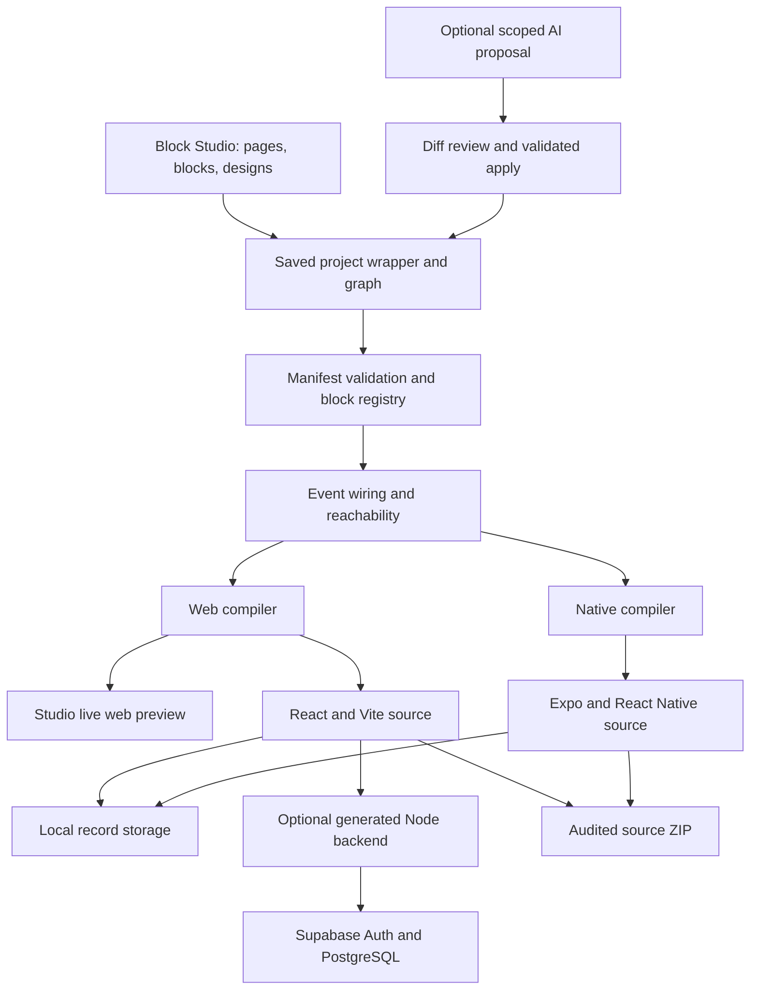

# Block Framework and Block Studio: complete project overview

**Snapshot:** 9 October 2026, including the code-quality cleanup in the current working tree.

This document explains the implemented product, the editor, generated applications, service integrations, architecture, contracts, tooling, verification, and remaining work. It describes repository capabilities; local URLs are default addresses, not uptime checks. Previous milestone reports describe their own historical snapshots.

## Contents

1. [Project identity and current status](#1-project-identity-and-current-status)
2. [What Block Studio can do](#2-what-block-studio-can-do)
3. [The visual building workflow](#3-the-visual-building-workflow)
4. [All 19 implemented blocks](#4-all-19-implemented-blocks)
5. [Element design and button actions](#5-element-design-and-button-actions)
6. [Project graph and event routing](#6-project-graph-and-event-routing)
7. [App library, persistence, and recovery](#7-app-library-persistence-and-recovery)
8. [Paper: local notes application](#8-paper-local-notes-application)
9. [Paper Cloud: accounts, storage, and payments](#9-paper-cloud-accounts-storage-and-payments)
10. [AI tokens and other operating costs](#10-ai-tokens-and-other-operating-costs)
11. [Repository architecture and source map](#11-repository-architecture-and-source-map)
12. [Compilation, previews, and exported source](#12-compilation-previews-and-exported-source)
13. [AI editor and ChatGPT connection](#13-ai-editor-and-chatgpt-connection)
14. [Profile cascade and block cards](#14-profile-cascade-and-block-cards)
15. [HTTP APIs and security boundaries](#15-http-apis-and-security-boundaries)
16. [Entity Spine and database scaffolding](#16-entity-spine-and-database-scaffolding)
17. [External services and configuration](#17-external-services-and-configuration)
18. [Installation and command-line workflows](#18-installation-and-command-line-workflows)
19. [Extending the framework](#19-extending-the-framework)
20. [Tests, benchmarks, and current evidence](#20-tests-benchmarks-and-current-evidence)
21. [Code-quality changes](#21-code-quality-changes)
22. [Limits and release readiness](#22-limits-and-release-readiness)
23. [Plans and documentation index](#23-plans-and-documentation-index)
24. [Glossary and practical interpretation](#24-glossary-and-practical-interpretation)

## 1. Project identity and current status

**Block Framework** is the underlying schema, registry, wiring engine, compiler, storage runtime, and optional agent system. **Block Studio** is its local visual editor. The editor produces a structured project graph, which the compiler turns into editable application source.

The implemented product supports:

- Responsive React/Vite web applications.
- Expo/React Native mobile source for supported local application features.
- Persistent local notes on web and native targets.
- Account-based cloud notes with a generated Node backend and Supabase migration on the web target.
- Optional AI editing of supported content, variants, and design fields.

The compiler is deterministic and does not call an LLM. New functionality becomes reusable when implemented in the framework's blocks, runtimes, compiler, and service contracts.

| Item                                | Current contract                                                    |
| ----------------------------------- | ------------------------------------------------------------------- |
| Repository                          | TypeScript npm-workspace monorepo with 8 packages                   |
| Root package                        | `block-framework`, version `0.1.0`                                  |
| Graph schema                        | `schemaVersion: "0"`                                                |
| Studio project wrapper              | `version: 1`                                                        |
| Built-in block types                | 19 registered types, each currently version `1.0.0`                 |
| Local backup format                 | `version: 1`                                                        |
| Studio default address              | `http://127.0.0.1:5174`                                             |
| Paper Cloud example backend address | `http://127.0.0.1:8787`                                             |
| Primary public output               | Owned source code and audited source ZIPs                           |
| Hosted publish orchestration        | Further integration work                                            |
| Cloud native export                 | Explicitly rejected until its real service transport is implemented |

The notes application is a working demonstration of reusable application construction. The full cloud application was assembled through a Studio graph after missing capabilities were added to the framework. Implementing those capabilities required framework code. Recreating the current app from the existing capabilities does not require another LLM-generated implementation.

## 2. What Block Studio can do

| Capability           | Implemented behavior                                                      | Scope or qualification                                   |
| -------------------- | ------------------------------------------------------------------------- | -------------------------------------------------------- |
| App library          | Create, switch, delete, and restore independent apps                      | Local catalog; deleted apps remain recoverable           |
| Starter creation     | Create a connected starter with 2 pages and 4 editable blocks             | Adds an app without replacing the existing library       |
| Local notes template | Create Paper with working persistent records                              | Web and native source                                    |
| Cloud notes template | Create Paper Cloud with accounts and service blocks                       | Requires a configured backend; web output                |
| Page flow canvas     | Move pages, inspect previews, connect events, and select destinations     | Canvas position is separate from application layout      |
| Page composition     | Place several ordered blocks on a page                                    | Stack, grid, and split page layouts                      |
| Block library        | Add supported blocks using valid starter configurations                   | Registry-backed palette                                  |
| Inspector            | Change schema-declared content, appearance variants, ordering, and routes | Invalid edits are rejected                               |
| Element designer     | Select elements, drag offsets, and adjust supported visual properties     | Shared web preview and exported runtime                  |
| Shared styling       | Apply matching element styles across blocks                               | Matches element identities in the active app             |
| Element insertion    | Add text, buttons, and dividers inside a block                            | Explicit insertion order and independent controls        |
| Button actions       | Navigate, go back, open an HTTP/HTTPS URL, show a message, or do nothing  | Actions are validated and represented in design metadata |
| Connection cutting   | Cut automatic or explicit event routes and restore them                   | A cut persists in the graph                              |
| Layout-guide cutting | Cut a render-order guide                                                  | Both blocks remain on the page                           |
| Page visibility      | Hide an editor or another page from navigation                            | Hidden pages remain reachable through events             |
| Manual recovery      | Undo/redo accepted edits and use keyboard shortcuts                       | Bounded 50-snapshot manual history                       |
| Preview              | Run the generated web app at desktop or phone widths                      | Phone width is responsive web, not a native emulator     |
| Local records        | Autosave, search, folders, tags, favorite/pin/archive/trash               | Fixed text-record model                                  |
| Backups              | Export/import validated note backups                                      | Merges records by ID and timestamp                       |
| Cloud accounts       | Google and verified-email account flows                                   | Generated backend and Supabase                           |
| Cloud persistence    | Private per-account records with revision checks                          | Server/database enforcement                              |
| Plan access          | Free, Plus, Pro, quotas, expiration, and account display                  | Paper-specific prices and limits                         |
| UPI testing          | Generate payment links/QRs and submit references                          | Actual receipt checking is manual                        |
| Owner review         | Review submitted payments and grant/reject access                         | Restricted server-authorized workflow                    |
| AI editing           | Propose scoped edits, review diff, apply, and undo                        | Supported graph fields only                              |
| ChatGPT connection   | Local OAuth connection, account/model selection, protected persistence    | Provider eligibility and permissions apply               |
| Developer tools      | Inspect cards, edit/import/save project JSON, configure backend URL       | Validation protects saved projects                       |
| Web export           | Generate standalone React/Vite source                                     | Static output for local apps; backend for cloud apps     |
| Mobile export        | Generate Expo/React Native source                                         | Local features; native cloud integrations unavailable    |
| Source ZIP           | Audit content and emit repeatable archives                                | Includes source and run instructions                     |
| Block SDK            | Scaffold, test, validate, and register native block contracts             | Custom web rendering requires corresponding runtime work |
| Database scaffold    | Generate SQL and TypeScript database types from an Entity Spine           | Does not automatically bind arbitrary tables to blocks   |

## 3. The visual building workflow

### 3.1 Choose or create an application

Start Studio and click the application name in the sidebar. Choose an existing app, create a starter, create a Notes app, or create Cloud notes. The library stores separate graphs and stable app IDs. Switching apps resets workspace history and pending agent plans to avoid mixing edits between apps.

### 3.2 Design page flow

Pages appear as nodes on the overview canvas. Move them to organize the editor view. Open a page by double-clicking its node or selecting it from the sidebar. Connect event ports to override automatic routing. A selected wire can be cut through its control or the Delete key.

Node movement controls diagram organization. The finished application's page layouts and navigation are governed by the graph's composition and routing contracts.

### 3.3 Compose a page

Add a block from the palette by clicking or dragging it onto the page canvas. A page can contain several blocks. Adjust their order, choose stack/grid/split, and connect compatible event outputs to consumers. Duplicate a block to create a separate instance with its own ID, config, and design.

### 3.4 Edit block content

The inspector generates forms from each block's configuration schema. Examples include hero copy, quiz questions, pricing products, list items, profile fields, settings sections, and record-collection options. Appearance variants expose the supported alternative layouts. Invalid values fail validation rather than being saved as a working project.

### 3.5 Customize elements and actions

Open **Customize inside this block**. Select an element in the preview, change supported properties, inspect desktop/phone widths, and apply the design. Use the element library for added text/buttons/dividers. Save labels and button actions independently where the designer exposes that operation.

### 3.6 Test behavior

Preview exercises the generated application runtime. Check navigation, same-page payload delivery, browser back, record persistence, and the relevant account/service flows. Cloud canvas thumbnails and design previews use temporary preview data; opening the connected cloud app can write real account data.

### 3.7 Export and operate the app

Download web or mobile source. A local web app builds to static files. A cloud web app includes a backend and SQL migration and needs operator configuration. A mobile project needs its Expo dependencies and native release workflow. Source export provides an editable codebase; deployment and store submission remain operator steps.

## 4. All 19 implemented blocks

All references below are used as `<type>@1.0.0` in a graph. Variants are declared by the manifests and validated by the framework.

| Type                 | Variants                  | Implemented role                                               | Service/target behavior                            |
| -------------------- | ------------------------- | -------------------------------------------------------------- | -------------------------------------------------- |
| `content.hero`       | `default`, `compact`      | Eyebrow, title, body, connected CTA                            | Web and native                                     |
| `content.text`       | `default`, `compact`      | Section title and supporting copy                              | Web and native                                     |
| `action.button`      | `default`, `compact`      | Focused action button                                          | Web and native                                     |
| `auth.email`         | `signin`, `signup`        | Demonstration email sign-in/sign-up                            | Local mock auth, web and native                    |
| `onboarding.quiz`    | `quiz-cards`, `quiz-list` | Questions, answer selection, progress, optional skip           | Web and native                                     |
| `paywall.basic`      | `cards`, `compact`        | Product plans, purchase and restore flows                      | Local mock billing, web and native                 |
| `home.list`          | `list`, `grid`            | Browse items and emit the selected item                        | Configured list content, web and native            |
| `content.detail`     | `article`, `product`      | Receive a selected item and show details/action                | Payload-aware web and native                       |
| `stats.overview`     | `row`, `grid`             | Display configured metrics                                     | Web and native; not automatic analytics            |
| `profile.card`       | `card`, `compact`         | Name, handle, biography, configured stats                      | Web and native                                     |
| `settings.list`      | `list`, `grouped`         | Local toggles and settings rows                                | Link/integration rows require their actual service |
| `data.collection`    | `default`                 | Browse/create/filter records and manage folders/backups        | Local web/native; cloud transport on web           |
| `data.editor`        | `default`                 | Edit a selected/new note with autosave and Markdown/checklists | Local web/native; cloud transport on web           |
| `data.summary`       | `default`                 | Show live counts for a shared collection                       | Local web/native; cloud transport on web           |
| `auth.account`       | `default`                 | Google, verified email, account recovery/reset                 | Real cloud web integration                         |
| `onboarding.profile` | `default`                 | Persist name/focus onboarding and profile edits                | Real cloud web integration                         |
| `billing.plans`      | `default`                 | Show Free/Plus/Pro, payment link/QR, claim/history             | Real cloud web with manual receipt verification    |
| `account.settings`   | `default`                 | Verified identity, access plan, account actions, sign-out      | Real cloud web integration                         |
| `billing.review`     | `default`                 | Owner payment queue and approval/rejection controls            | Restricted cloud web integration                   |

### 4.1 Configuration fields

| Block                                | Declared configuration fields                                                                                               |
| ------------------------------------ | --------------------------------------------------------------------------------------------------------------------------- |
| `content.hero`                       | `eyebrow`, `title`, `body`, `ctaText`                                                                                       |
| `content.text`                       | `title`, `body`                                                                                                             |
| `action.button`                      | `ctaText`                                                                                                                   |
| `auth.email`                         | `ctaText`, `headline`, `subheadline`                                                                                        |
| `onboarding.quiz`                    | `questions`, `skippable`                                                                                                    |
| `paywall.basic`                      | `ctaText`, `headline`, `products`, `subheadline`                                                                            |
| `home.list`                          | `items`, `subtitle`, `title`                                                                                                |
| `content.detail`                     | `ctaText`, `showImage`                                                                                                      |
| `stats.overview`                     | `stats`, `title`                                                                                                            |
| `profile.card`                       | `bio`, `handle`, `name`, `stats`                                                                                            |
| `settings.list`                      | `sections`, `title`                                                                                                         |
| `data.collection`                    | `collectionKey`, `title`, `subtitle`, `view`, `createLabel`, `enableSearch`, `enableFolders`, `enableBackup`, `seedRecords` |
| `data.editor`, `data.summary`        | `collectionKey`, `title`, `subtitle`                                                                                        |
| `auth.account`, `billing.plans`      | `title`, `subtitle`                                                                                                         |
| `onboarding.profile`                 | `title`, `ctaText`                                                                                                          |
| `account.settings`, `billing.review` | `title`                                                                                                                     |

Manifest schemas define the detailed shapes, validation rules, defaults, editable AI surfaces, and locked fields. Listing a configuration field here does not make it universally AI-editable.

### 4.2 Event contracts

| Producer                                | Emitted event(s)                                                               | Relevant consumer                                         |
| --------------------------------------- | ------------------------------------------------------------------------------ | --------------------------------------------------------- |
| `content.hero`, `action.button`         | `action.pressed`                                                               | Explicit page destination or automatic next-page routing  |
| `auth.email`, `auth.account`            | `auth.completed`                                                               | `onboarding.profile` consumes the real account event      |
| `onboarding.quiz`, `onboarding.profile` | `onboarding.completed`                                                         | Configured destination                                    |
| `paywall.basic`                         | `paywall.completed`, `paywall.restored`                                        | Purchase and restore can have distinct destinations       |
| `home.list`                             | `home.itemSelected`                                                            | `content.detail` consumes the selected-item payload       |
| `content.detail`                        | `content.action`                                                               | Configured destination                                    |
| `data.collection`                       | `data.recordSelected`                                                          | `data.editor` consumes `{ collection, recordId }`         |
| `data.editor`                           | `data.closed`                                                                  | Collection page or another configured destination         |
| `billing.plans`                         | `billing.continued`                                                            | Configured destination                                    |
| `account.settings`                      | `account.plans`, `account.profile`, `account.reviewPayments`, `auth.signedOut` | Separate plan/profile/owner/auth destinations             |
| Added/designed button                   | `element.<elementId>.pressed`                                                  | A configured navigation action produces a routeable event |

`app.launched` and `paywall.show` are convention-satisfied lifecycle inputs. Read-only text, stats, profile, summary, and payment-review blocks do not all need outgoing events.

## 5. Element design and button actions

Design overrides are stored inside a block's `design` field. The portable contract supports:

| Property group           | Supported fields                                          |
| ------------------------ | --------------------------------------------------------- |
| Position                 | `x`, `y`                                                  |
| Size and spacing         | `width`, `height`, `padding`, `marginTop`, `marginBottom` |
| Shape and color          | `borderRadius`, `color`, `backgroundColor`, `opacity`     |
| Typography               | `fontSize`, `fontWeight`, `textAlign`                     |
| Alignment and visibility | `alignSelf`, `hidden`                                     |

Schema bounds include offsets from -2000 to 2000, size/spacing from 0 to 2000, font sizes from 8 to 200, opacity from 0 to 1, and six-digit hex colors. Font weights range from `"400"` through `"800"` in the declared options.

`design.content` holds added buttons/text/dividers. `before` controls insertion relative to an existing element. Added IDs use the `custom-...` convention, and the contract caps inserted content at 100 elements per block. `design.actions` holds per-element actions. `design.disconnectedEvents` records persistent event cuts.

```json
{
  "design": {
    "elements": {
      "button": { "width": 200, "borderRadius": 12, "backgroundColor": "#345E4F" },
      "title": { "fontSize": 32 }
    },
    "content": [{ "id": "custom-help", "type": "button", "text": "Help" }],
    "actions": {
      "custom-help": { "type": "message", "message": "Choose a note to start editing." }
    }
  }
}
```

Supported actions are `none`, `navigate`, `back`, `url`, and `message`. Navigation destinations and URL schemes are validated. Newly added buttons are inert until an action is configured. Existing built-in buttons retain their original block behavior until explicitly overridden. Removing a destination page resets its dependent designer navigation actions.

Web applies overrides to identified rendered elements. Native customization transforms generated JSX and supported React Native styles while preserving event handlers and Pressable callbacks. Shared elements such as container/title/button/input have corresponding identities; decorative or repeated web internals may have no identical native counterpart. Detailed internal styling of native data controls remains more limited than web design controls.

## 6. Project graph and event routing

### 6.1 Project layers

The saved Studio document wraps the graph:

```json
{
  "version": 1,
  "profile": null,
  "touched": [],
  "graph": {
    "schemaVersion": "0",
    "app": { "name": "My app", "slug": "my-app", "version": "1.0.0" },
    "screens": [
      {
        "id": "home",
        "title": "Home",
        "block": "intro",
        "blocks": ["intro", "copy"],
        "layout": "stack"
      },
      { "id": "next", "title": "Next", "block": "next-copy" }
    ],
    "blocks": [
      {
        "id": "intro",
        "type": "content.hero@1.0.0",
        "config": { "title": "Welcome", "body": "Start here", "ctaText": "Continue" }
      },
      {
        "id": "copy",
        "type": "content.text@1.0.0",
        "config": { "title": "Your first page", "body": "Compose supported blocks." }
      },
      {
        "id": "next-copy",
        "type": "content.text@1.0.0",
        "config": { "title": "Next page", "body": "Navigation came from an event." }
      }
    ],
    "wires": [
      { "from": { "instance": "intro", "event": "action.pressed" }, "to": { "screen": "next" } }
    ]
  }
}
```

| Graph field                            | Meaning                                                                    |
| -------------------------------------- | -------------------------------------------------------------------------- |
| `app.name`, `slug`, `version`          | Application identity and generated package metadata                        |
| `app.theme`                            | Primary/background/text colors                                             |
| `app.dataId`                           | Stable local record-storage namespace                                      |
| `app.layout`                           | Standard or notes application shell                                        |
| `app.cloud`                            | Public Supabase-backend connection declaration; never provider credentials |
| `screens[].block`                      | Required primary block for legacy compatibility                            |
| `screens[].blocks`                     | Complete ordered composition when supplied; includes the primary block     |
| `screens[].layout`                     | Stack/grid/split                                                           |
| `screens[].navigation`                 | Whether the page appears in the app menu                                   |
| `screens[].lane`                       | Main flow or a non-main lane such as `tabs`                                |
| Page/block `position`                  | Editor coordinates                                                         |
| `screens[].disconnectedLayout`         | Cut incoming render-order guides                                           |
| `blocks[].type`                        | Registered block ID plus version                                           |
| `blocks[].config`, `variant`, `design` | Content, appearance, and design/action metadata                            |
| `wires`                                | Explicit event connections                                                 |
| Wrapper `profile`                      | Six-field branding/content profile                                         |
| Wrapper `touched`                      | Hand-customized paths protected from automatic replacement                 |

A block instance belongs to at most one page. Reusing the same type on another page creates another instance. Block configuration is merged with manifest defaults during generation.

### 6.2 Routing order

The wiring engine resolves emitted events in this order:

1. A validated explicit wire.
2. A uniquely matching semantic consumer, preferring the producer's own page.
3. The next page in graph order when no semantic consumer exists.
4. A terminal event if no destination exists.

Persistent cuts and explicit designer action overrides alter this routing. Multiple equally eligible consumers require an explicit choice. Payload compatibility is checked for the supported object-property subset of JSON Schema. A semantic connection identifies the consumer instance and port; same-page payload delivery updates the consumer without navigating away.

The wiring report includes resolved connections, unmet events/requirements, ambiguities, warnings, notes, and flow reachability. Pages in supported non-main lanes such as `tabs` can be reachable through navigation even when no main-flow event targets them.

## 7. App library, persistence, and recovery

Studio maintains two kinds of saved state:

- The active project, normally `.builder-cache/project.blockfw.json`.
- The adjacent catalog, normally `.builder-cache/project.blockfw.json.apps.json`, containing independent apps and recoverable deleted entries.

Back up both files for the complete editor library. Application records themselves use their own local stores or cloud database and need their corresponding backup strategy.

Each new app gets a stable ID. Rename and project imports preserve the active app's storage namespace. Independent copies receive fresh IDs even if names and slugs match. At least one active app must remain; attempting to delete the last app is rejected.

The browser serializes project saves and app actions. Requests carry `X-Block-App-Id`, and the server rejects saves from a stale app context. Accepted manual changes populate a bounded 50-snapshot undo/redo history. Invalid writes retain the saved project and report an error. Refreshing externally changed state clears obsolete manual history.

Catalog updates use temporary-file replacement and retry transient Windows file-lock errors. Switching apps resets manual history and the active app's agent gateway and invalidates pending plans. Manual undo/redo and AI undo are separate histories with separate interference checks.

## 8. Paper: local notes application

The local template in [`examples/notes/graph.json`](../examples/notes/graph.json) contains **5 pages, 6 blocks, and 5 explicit wires**. Its pages are All notes, Favorites, Archive, Trash, and Edit note. The editor is hidden from normal app navigation and reached through record selection.

### 8.1 Implemented features

- Create notes and reopen selected records.
- Autosave and persistent reload.
- Title/body editing and Markdown formatting/checklists.
- Search and filtered views.
- Folder creation and management.
- Tags, favorites, and pinning.
- Archive/unarchive.
- Trash, restore, and permanent deletion.
- Live collection summaries.
- Backup export/import with validation and merge rules.
- Record links in the web URL hash.
- Several collection/editor blocks sharing one collection, including on one composed page.
- Independent records for distinct application IDs.
- Temporary design previews that do not persist sample edits.

### 8.2 Record model and storage

```ts
type Note = {
  id: string;
  title: string;
  body: string;
  folder: string;
  tags: string[];
  favorite: boolean;
  pinned: boolean;
  archived: boolean;
  trashed: boolean;
  createdAt: string;
  updatedAt: string;
};
type Database = { version: 1; records: Note[]; folders: string[] };
```

Web stores local records through `localStorage`; native uses Expo-compatible AsyncStorage. Stores are scoped by stable app ID and collection key. Browser profile/origin and native installation also determine which store is available. The Studio origin and a separately hosted app have separate local stores; move data using backups.

Matching `collectionKey` values share records within the app. Favorites/archive/trash are views over the same records. Seed records initialize a new collection and do not replace already-saved notes when the graph changes.

### 8.3 Backup and recovery behavior

Imports reject unsupported formats, malformed records, duplicate IDs, and invalid dates before writing. Valid imports merge by record ID and keep a newer local version. A previous backup can restore a permanently deleted record.

Native writes are serialized to avoid out-of-order saves. Loading/saving/success/failure are represented in feedback. Corrupt local storage is reported rather than silently replaced with samples. Failed writes preserve an in-memory draft for backup recovery.

### 8.4 Platform differences

Web formatting wraps selected text; native controls insert Markdown. Web folders support create/rename/remove with reassignment to Inbox; native supports creation and merging into Inbox. Native backup export uses the share sheet, and import accepts pasted backup JSON. Web listens for storage updates from other tabs; simultaneous editing is not real-time collaboration.

The fixed text-record model does not implement attachments, reminders, arbitrary custom entity schemas, or collaborative editing.

## 9. Paper Cloud: accounts, storage, and payments

The cloud template in [`examples/paper-cloud/graph.json`](../examples/paper-cloud/graph.json) contains **10 pages, 11 blocks, and 12 explicit wires**. It extends the notes pages with Sign in, Your profile, Plans, Account, and Payment review.

### 9.1 Real account and onboarding features

- Google OAuth through Supabase Auth.
- Email/password signup and login requiring confirmed email.
- Email recovery and password reset.
- Sign-out that invalidates the application session.
- Persisted name and Personal/Work/Study focus onboarding.
- Automatic account/onboarding gates for unfinished sessions.
- Reopening saved profile details for editing.
- Verified account identity and current plan display.

The default email flow uses PKCE. Signup/recovery links should open in the initiating browser. Confirmation in another browser can still verify the email, after which the user can return and sign in. Recovery must be restarted in the browser that opens its link. These are integration constraints described in the generated setup instructions.

### 9.2 Private cloud notes

Existing collection/editor/summary blocks use a cloud adapter instead of local storage. Supabase PostgreSQL is the source of truth. Saves carry an optimistic revision, so a stale device write fails visibly rather than silently replacing another revision. Rapid edits are combined/queued, unsaved drafts survive failed saves, and recovery can export an unsaved snapshot. A late remote refresh cannot replace a newer local edit.

The backend uses authenticated RPC writes and RLS. `X-Paper-Account` prevents an editor from an old tab saving after a different account signs in. A disconnected/unconfigured cloud app fails visibly; it does not present local storage as a successful cloud save.

### 9.3 Plans and manual UPI workflow

| Plan | User-visible price | Backend amount in paise | Note limit |
| ---- | -----------------: | ----------------------: | ---------: |
| Free |              INR 0 |                       0 |         25 |
| Plus |            INR 500 |                  50,000 |      1,000 |
| Pro  |          INR 1,000 |                 100,000 |     10,000 |

Paid access is a prepaid pass, **30 days by default**, controlled by `PAID_ACCESS_DAYS`. Renewal is manual. Expiration restores Free limits without deleting existing notes; over-limit data remains available under the supported read/edit/remove rules, while increasing usage is restricted.

Payment state progresses through `pending → submitted → approved/rejected`:

1. The backend selects the fixed plan/amount and creates or reuses a pending payment.
2. The app displays an actual UPI URI and QR code.
3. The customer pays through their bank/UPI app and submits a transaction reference.
4. The verified owner checks the actual bank receipt.
5. The owner explicitly acknowledges receipt verification and approves or rejects with a note.
6. An audited, idempotent database operation updates entitlement only after approval.

Reference submission alone does not grant paid access. The browser cannot set its own price, entitlement, owner status, or approval. The current integration uses personal UPI for testing; it does not implement merchant webhooks, automatic receipt matching, or recurring debit.

### 9.4 Database objects

| Table/function          | Responsibility                                                      |
| ----------------------- | ------------------------------------------------------------------- |
| `paper_profiles`        | Account profile and onboarding completion                           |
| `paper_collections`     | Per-user collection JSON, revision, update time                     |
| `paper_payments`        | Plan/amount/reference/status and review metadata                    |
| `paper_entitlements`    | Current paid access and expiration                                  |
| `paper_sessions`        | Protected application sessions and encrypted provider token bundles |
| `paper_payment_audit`   | Payment review audit records                                        |
| `paper_save_collection` | Ownership, revision, collection validation, and quota enforcement   |
| `paper_review_payment`  | Audited/idempotent owner payment decision and entitlement update    |

Each independently deployed app needs its own intended backend/Supabase isolation. Two graphs using one backend deliberately share that backend's accounts, notes, prices, and plans. Renaming a graph does not provision a separate database.

### 9.5 Existing live evidence and release limits

The setup record documents live Google login, saved onboarding, note save/reload/restart, the same cloud account loaded inside Studio, restricted owner navigation, and correctly formed UPI choices. It also records nine live database checks for authenticated writes, cross-user isolation, privileged-write restrictions, quotas, malformed data, and revision conflicts.

The live checks did not transfer money or verify a bank receipt/paid grant. Public SMTP, broader Google audience configuration, public HTTPS hosting, and full public-release account/recovery/payment checks remain operator work. See [Paper Cloud setup and evidence](paper-cloud-setup.md) and [sanitized database verification](cloud-live-verification.json).

## 10. AI tokens and other operating costs

| Activity                                                 | LLM inference needed?                       | Other requirements                                |
| -------------------------------------------------------- | ------------------------------------------- | ------------------------------------------------- |
| Create/configure a supported app manually                | No                                          | Existing registry and editor                      |
| Recreate local Paper or Paper Cloud from their templates | No                                          | External services for Cloud                       |
| Drag pages/blocks, connect events, style elements        | No                                          | Supported graph/design contract                   |
| Compile, validate, preview, or export                    | No                                          | Local build dependencies                          |
| Use a generated notes app                                | No                                          | Local storage or configured cloud services        |
| Recorded AI demo                                         | No real model call                          | Only prerecorded matching instructions            |
| Ask a live provider/ChatGPT to edit                      | Yes                                         | Authorized account/provider and available usage   |
| Add an unsupported feature                               | Developer work; optional AI consumes tokens | Framework/runtime/backend changes as needed       |
| Deploy or distribute publicly                            | LLM use is optional                         | Hosting, service setup, and platform release work |

Zero LLM tokens means inference is unnecessary for supported operations. It does not mean zero infrastructure cost, zero human setup, or automatic publication. Studio does not automatically sign up for providers, supply production credentials, deploy a public site, sign a mobile binary, or submit to app stores.

The framework's small scoped AI context is intended to reduce the work sent to a model. The repository does not establish a universal cost reduction against arbitrary coding agents or guarantee token-free creation of capabilities outside the current library.

## 11. Repository architecture and source map



### 11.1 Packages

| Package              | Responsibility                                                                                        | Main source references                                                                                                                                                                          |
| -------------------- | ----------------------------------------------------------------------------------------------------- | ----------------------------------------------------------------------------------------------------------------------------------------------------------------------------------------------- |
| `@blockfw/manifest`  | Authoritative JSON schemas, mirrored types, design/action contracts, validation                       | [types](../packages/manifest/src/types.ts), [validation](../packages/manifest/src/validate.ts), [design](../packages/manifest/src/design.ts), [schemas](../packages/manifest/src/schema/)       |
| `@blockfw/blocks`    | Block registry, manifests, native templates, sample configs, SDK, canonical JSON                      | [registry](../packages/blocks/src/registry.ts), [render types](../packages/blocks/src/types.ts), [SDK](../packages/blocks/src/sdk.ts), [blocks](../packages/blocks/src/blocks/)                 |
| `@blockfw/wiring`    | Config checks, service requirements, semantic/explicit routing, payload compatibility, flow reporting | [engine](../packages/wiring/src/engine.ts), [types](../packages/wiring/src/types.ts)                                                                                                            |
| `@blockfw/compiler`  | Web/native source generation, customization, CLI, storage runtimes, cloud assets, ZIP audit           | [native compiler](../packages/compiler/src/compile.ts), [web compiler](../packages/compiler/src/compile-web.ts), [CLI](../packages/compiler/src/cli.ts), [assets](../packages/compiler/assets/) |
| `@blockfw/spine`     | Entity declarations to PostgreSQL DDL and TypeScript database contracts                               | [validation/types](../packages/spine/src/types.ts), [SQL](../packages/spine/src/sql.ts), [TypeScript](../packages/spine/src/typescript.ts)                                                      |
| `@blockfw/agent`     | Provider abstraction, prompts, scope checking, edit planning/apply/undo, usage reporting              | [gateway](../packages/agent/src/gateway.ts), [scope](../packages/agent/src/scoping.ts), [planner](../packages/agent/src/planner.ts), [providers](../packages/agent/src/providers.ts)            |
| `@blockfw/builder`   | Local HTTP server, catalog, profile cascade, credential connection, React editor                      | [server](../packages/builder/src/server.ts), [apps](../packages/builder/src/apps.ts), [UI](../packages/builder/ui/src/)                                                                         |
| `@blockfw/benchmark` | Mechanical graph/compiler tasks, recorded-agent tasks, export checks, optional live spot check        | [tasks](../packages/benchmark/src/tasks.ts), [runner](../packages/benchmark/src/runner.ts), [CLI](../packages/benchmark/src/cli.ts)                                                             |

### 11.2 Editor implementation

| File                  | Main role                                                                                           |
| --------------------- | --------------------------------------------------------------------------------------------------- |
| `Workspace.tsx`       | Current page/block selection, library, dialogs, previews, exports, project/cloud developer controls |
| `FlowCanvas.tsx`      | React Flow nodes, handles, port connections, canvas drag, layout guides, fit/zoom/minimap           |
| `Inspector.tsx`       | Schema forms, variants, route selection, duplication, deletion, composition order                   |
| `DesignEditor.tsx`    | Element selection, draft style preview, dragging, shared styles, added content/actions              |
| `useProject.ts`       | Loading, serialized mutations, app actions, save state, manual undo/redo                            |
| `api.ts`              | Browser HTTP client, active-app identity header, shared API types                                   |
| `AgentView.tsx`       | Instruction/scope, reviewed overwrite, plan/diff, apply/undo, usage                                 |
| `ChatGPTSettings.tsx` | Account connection controls, models, first-use acknowledgement, usage link                          |
| `ProfileWizard.tsx`   | Shared six-question profile form and cascade feedback                                               |
| `CardsView.tsx`       | Compact block contract inspection                                                                   |
| `workspace.css`       | Current Studio layout and visual styling                                                            |

The main libraries are React, React Flow, Lucide, RJSF/Ajv forms, Vite, esbuild, TypeScript, Ajv, and the ZIP library. Native exports use Expo and React Navigation. Cloud QR generation uses `qrcode`; OAuth identity verification uses `jose`; Studio credential encryption uses the OS credential store through `@napi-rs/keyring`.

Inspector, designer, agent, profile wizard, and cards UI are lazy-loaded. Some generated runtimes are source strings because the compiler emits standalone projects. Cloud runtime/server/schema/styles are readable asset files under `packages/compiler/assets/`.

Codex plugins such as Ponytail and ECC are development-session tools. They are not required dependencies of exported Block Studio applications.

### 11.3 Top-level directories

```text
block-framework/
  packages/              Eight implementation packages and their tests
  examples/              Ready-to-compile graphs and sample entity spine
  docs/                  Capability, setup, verification, audit, and planning documents
  scripts/               Legacy CI/demo helpers and explicit live-model trials
  .builder-cache/        Ignored local project/catalog files, preview output, and proof
  .audit-work/           Ignored audit comparison and fresh-export verification files
  package.json           Workspace commands
  package-lock.json      Root dependency lock
  tsconfig*.json         Package references and common/test TypeScript settings
  eslint.config.js       Source lint configuration
  vitest.config.ts       Unit/render test configuration
```

### 11.4 Included graphs

| Example                     | Pages | Blocks | Explicit wires | Purpose                                                 |
| --------------------------- | ----: | -----: | -------------: | ------------------------------------------------------- |
| `examples/studio`           |     8 |     10 |              0 | Composed Habitual-style demo used by the initial editor |
| `examples/notes`            |     5 |      6 |              5 | Local Paper with shared records                         |
| `examples/paper-cloud`      |    10 |     11 |             12 | Real-service Paper web template                         |
| `examples/subscription-app` |     3 |      3 |              0 | Small onboarding/paywall/list compiler example          |
| `examples/full-app`         |     8 |      8 |              0 | Earlier full demo and optional entity-spine example     |

Zero explicit wires means those examples exercise automatic/convention routing, not that their pages have no behavior.

## 12. Compilation, previews, and exported source

### 12.1 Compiler pipeline

1. Validate contracts and registered block references through the graph/wiring path.
2. Merge each block's config with manifest defaults.
3. Resolve routes, consumer inputs, and service requirements.
4. Render source for the chosen target.
5. Apply supported native design transformations where required.
6. Hash emitted paths and contents.
7. Emit a wiring report and, when requested, audit/archive the project.

`compileWebProject(graph, registry)` generates web source. `compileProject(graph, registry, spine?)` generates native source. Graph import paths validate before compilation; the wiring engine performs additional cross-reference/config/route checks. Generated TypeScript/build verification remains a separate quality step.

### 12.2 Web export

The local Paper example currently emits **13 files**:

```text
.gitignore
index.html
package.json
README.md
tsconfig.json
src/main.tsx
src/runtime.tsx
src/data-core.ts
src/data-runtime.tsx
src/styles.css
src/project.json
src/wires.json
src/wiring-report.json
```

The runtime handles block rendering, composition, hash routes, browser history, same-page inputs, element designs/actions, demo interactions, and local records. After `npm run build`, local web output can be hosted as static files.

### 12.3 Cloud web export

Cloud Paper emits **20 files**, adding:

```text
src/cloud-runtime.tsx
server/index.mjs
supabase/migrations/001_paper_cloud.sql
.env.example
CLOUD-SETUP.md
Dockerfile
.dockerignore
```

Cloud package scripts include `start` and `check:cloud`. The Node backend serves the built application and API. The Dockerfile builds frontend assets and packages the server for an operator-configured environment. The exported credential fields are blank; supplied owner/UPI values are testing defaults that an operator must review for another app.

The backend's plan prices and quotas are implemented for Paper. Editing presentation text alone does not change authoritative prices, SQL constraints, or entitlements.

### 12.4 Native export

Native output includes package/app/Babel/TypeScript setup, root registration, `App.tsx`, typed navigation, theme, generated block components, page wrappers, mock auth/billing modules, README, and wiring report. Data graphs additionally receive the portable data core, native data runtime, and AsyncStorage dependency. A supplied spine adds database SQL/types/client bootstrap.

Composed pages render several blocks inside a scrollable layout. Same-page consumer payloads use typed state; cross-page payloads use navigation parameters. Non-main navigation pages have native controls. Supported added design elements/actions compile into native source.

The current pinned native core includes Expo `57.0.27`, React `19.2.3`, and React Native `0.86.3`. Exact pins and navigation dependencies live in `PINNED_DEPS`/`PINNED_DEV_DEPS` in the native compiler. These are repository pins, not a statement about the newest provider releases.

### 12.5 Preview fidelity and isolation

Studio's interactive `/api/run` preview compiles and bundles the same web runtime that exports use. Query options select an initial page, individual block, or embedded preview. Canvas/design previews use temporary records and disable live cloud actions. A connected whole-app preview is intentionally capable of real cloud operations.

The older `/api/preview/:id` endpoint renders generated native components through the DOM mock for static HTML. It remains a compatibility/developer path and is not a native emulator. The newer interactive workspace uses the web runtime for its live behavior.

### 12.6 Determinism and archive audit

Canonical JSON recursively sorts object keys. SHA-256 covers sorted file paths and contents, excluding the report that contains the hash itself. Identical inputs to the same compiler implementation produce repeatable files/hashes. Compiler changes can change output and hashes.

ZIP metadata uses fixed dates and permissions. Export audit checks excluded paths, likely secrets, and supported absolute-path indicators. Dependencies, scratch files, private environments, and build output are excluded; a blank `.env.example` is included and audited. Archive write/finalization errors now reject explicitly.

## 13. AI editor and ChatGPT connection

### 13.1 Editing contract

The optional AI gateway receives an instruction and a focus scope. Supported operation paths include:

```text
block:<instanceId>.config.<declaredKey>
block:<instanceId>.variant
block:<instanceId>.design
block:<instanceId>.design.elements.<elementId>
```

Config edits must be in the manifest's `editSurface`, outside locked paths, and valid against their schema. Variant/design values must satisfy their corresponding contracts. Existing touched paths and related ancestors/descendants are protected unless the request explicitly allows reviewed overwrite.

The gateway can retry rejected plans with reasons. A reviewed plan shows before/after fields. Application checks its scope again. Plans are bound to a fingerprint of the complete project, including profile, protected paths, and canvas positions. Intervening edits, app switches, or connection changes invalidate stale plans.

An empty operation list is a successful no-op. AI undo refuses to overwrite newer manual changes. Applying AI operations adds those paths to the protected set. AI does not freely modify screens, graph topology, block ports, template source, or backend implementations.

### 13.2 Provider modes

| Mode                       | Behavior                                                                             |
| -------------------------- | ------------------------------------------------------------------------------------ |
| Recorded provider          | Deterministic prompt-substring/response pairs; explicitly labelled demo behavior     |
| OpenAI-compatible provider | Thin fetch client using configured chat-completions endpoint, model, and API key     |
| Local ChatGPT account      | OAuth connection and public Responses requests using authorized account/model access |

Recorded responses cover their saved instructions only. They do not provide arbitrary instruction interpretation. Studio distinguishes a recorded result from a live result and reports usage. Block-card estimates use characters/4; live usage comes from the provider's response.

### 13.3 Local ChatGPT connection

The UI supports Continue with ChatGPT, several saved registrations/accounts, model selection, connection cancellation, first-use usage acknowledgement, sign-out, and a usage-settings link. Each registration retains its own issued client ID and verified identity; same-email registrations remain separate.

The connection implementation has:

- A persistent host UUID.
- Per-attempt OAuth state, nonce, and PKCE.
- A loopback callback listener and short-lived pending login.
- Signed ID-token verification of issuer/audience/expiry/subject/nonce.
- Required plan-use scope before inference.
- Account-specific model discovery.
- Serialized token renewal and atomic persistence of replacements.
- Active-request cancellation on identity/model changes.
- Remote revocation attempts and local token removal on sign-out.
- Actionable recovery for revoked sessions, model permissions, usage limits, and locked credential storage.

Inference uses streaming public Responses calls with `store: false`. A completed stream is required. Local time/response-size bounds apply; the flow does not enforce a provider-side output-token cap through `max_output_tokens`.

Credentials are stored outside the repo in an AES-256-GCM encrypted file. The key belongs to the operating system credential store. Windows uses `%LOCALAPPDATA%/BlockStudio/chatgpt.enc`; macOS/Linux use their configured application/config directories. Browser storage, graph files, ZIPs, and usage responses do not receive provider tokens. A storage lock prevents concurrent Studio processes racing refresh-token rotation.

This connection is local-editor functionality. It does not authenticate customers in generated apps or expose ChatGPT conversations. Automated tests verify the protocol with controlled transport; live account eligibility, consent, and inference must be checked with the provider account. See [connection details](chatgpt-connection.md).

## 14. Profile cascade and block cards

### 14.1 Profile cascade

The shared six questions are:

1. Application name.
2. Audience.
3. Tone.
4. Brand color.
5. Price.
6. Currency.

Derivation rules update selected app metadata, theme, authentication copy, and demonstration paywall copy/products. Tone matching supports playful, professional, and minimal-style copy. Protected paths prevent later automatic changes from replacing manual choices, including when an edited parent array contains a derived child field.

The profile cascade does not rewrite Paper Cloud's server-owned payment amounts or database rules. The UI reports applied paths and paths skipped because they were touched.

### 14.2 Block cards

Cards summarize manifest purpose, schemas, ports, editable fields, and locked fields in a compact deterministic format. The budget is checked using a character-based token estimate of at most 300 per card. Cards support developer inspection and the framework's compact-context approach; the current scoped planner also lists supported fields/current values rather than sending repository source to the model.

## 15. HTTP APIs and security boundaries

### 15.1 Local Studio server

The builder binds to loopback by default. It hosts the built SPA and local project/editor APIs. It is not a hosted multi-user authoring backend.

| Method     | Route                                                                              | Purpose                                             |
| ---------- | ---------------------------------------------------------------------------------- | --------------------------------------------------- |
| GET / PUT  | `/api/project`                                                                     | Read, validate, and replace active project          |
| GET / POST | `/api/apps`                                                                        | List catalog or create/activate another app         |
| POST       | `/api/apps/:id/activate`                                                           | Activate an app                                     |
| DELETE     | `/api/apps/:id`                                                                    | Move an app to recoverable deletion                 |
| POST       | `/api/apps/:id/restore`                                                            | Restore a deleted entry                             |
| PUT        | `/api/profile`                                                                     | Validate/set profile                                |
| POST       | `/api/cascade`                                                                     | Apply profile rules                                 |
| POST       | `/api/touch`                                                                       | Mark a protected path                               |
| GET        | `/api/blocks`                                                                      | Palette manifests and usable default configurations |
| GET        | `/api/cards`                                                                       | Compact contracts                                   |
| POST       | `/api/compile?target=web\|mobile`                                                  | Compile and return hash/file paths/wiring report    |
| POST       | `/api/export/zip?target=web\|mobile`                                               | Audit/export source ZIP                             |
| GET        | `/api/run`, `/api/run.js`                                                          | Generated interactive web preview and script        |
| GET        | `/api/preview/:id`                                                                 | Legacy static native-to-DOM preview                 |
| POST       | `/api/agent/edit`, `/api/agent/apply`, `/api/agent/undo`                           | AI plan/review/apply/undo workflow                  |
| GET        | `/api/agent/usage`                                                                 | Provider status, usage totals/log, AI undo depth    |
| GET        | `/api/agent/chatgpt/status`, `/api/agent/chatgpt/models`                           | Connection state and model catalog                  |
| POST       | `/api/agent/chatgpt/login`, `/cancel`, `/select`, `/model`, `/signout`, `/welcome` | Connection actions under that prefix                |

AI actions enforce local Host/Origin rules, reject cross-site requests, and require JSON mutations. ChatGPT APIs are disabled for non-loopback builder hosts. App-specific requests use the active-app header to protect against stale writes. Saved replacements validate graph structure and the appropriate compilation target; cloud projects are validated as web projects.

### 15.2 Generated cloud backend

| Method     | Route                                                     | Purpose                                          |
| ---------- | --------------------------------------------------------- | ------------------------------------------------ |
| GET        | `/healthz`                                                | Process liveness                                 |
| GET        | `/api/cloud/config`                                       | Public plans/payment configuration               |
| POST       | `/api/cloud/auth/signup`, `/login`, `/google`, `/recover` | Account entry and recovery under the auth prefix |
| GET        | `/api/cloud/auth/session`                                 | Verified session/profile/plan/owner state        |
| POST       | `/api/cloud/auth/password`, `/logout`                     | Complete reset or invalidate session             |
| PUT        | `/api/cloud/profile`                                      | Save validated name/focus/onboarding             |
| GET / PUT  | `/api/cloud/collections/:key`                             | Read/write private collection with revision      |
| GET / POST | `/api/cloud/payments`                                     | Customer history or fixed-plan payment creation  |
| POST       | `/api/cloud/payments/:id/claim`                           | Submit payment reference                         |
| GET        | `/api/cloud/owner/payments`                               | Restricted submitted-payment queue               |
| POST       | `/api/cloud/owner/payments/:id/review`                    | Restricted receipt-confirmed approve/reject      |
| GET        | `/auth/callback`, `/auth/confirm`                         | Provider/email callbacks                         |

The backend also serves built frontend files. Sensitive upstream calls use server-held credentials, not browser-supplied provider secrets.

### 15.3 Implemented cloud protections

- Opaque random application-session cookies; HttpOnly and secure production handling.
- Encrypted provider token bundles in protected server session records.
- Supabase identity verification and confirmed-email checks.
- PKCE and protected short-lived verifier cookies.
- Restricted recovery sessions until password reset is completed.
- Explicit allowed origins and JSON mutation requests.
- Input/body-size/rate limits and authenticated collection validation.
- RLS ownership checks and server/database quota enforcement.
- Protected session/entitlement/payment-audit writes.
- Owner identity checks plus explicit actual-receipt acknowledgement for approvals.
- Revision and stale-account safeguards.

Operational security still requires protected keys, valid provider configuration, HTTPS, appropriate proxy rate limits, backups, and monitoring. `/healthz` proves process liveness only; authenticated service readiness needs a separate check. These controls have test evidence, not a guarantee of an exhaustive independent security audit.

## 16. Entity Spine and database scaffolding

An Entity Spine defines named entities and fields. Supported field types are `uuid`, `text`, `int`, `bigint`, `bool`, `timestamptz`, `date`, `jsonb`, and `numeric`. Fields can declare nullability, one primary key per entity, uniqueness, SQL defaults, foreign-key targets, and supported deletion actions.

Validation checks names, duplicate declarations, required entity/field arrays, recognized types, primary-key count, and foreign-key entity references. The generators emit PostgreSQL table DDL and Supabase-style `Database` interfaces with Row/Insert/Update shapes. Defaults/nullable fields affect optional insert properties; update properties are optional.

The CLI can emit SQL, types, or both. Native compilation with `--spine` adds a migration, types, Supabase client bootstrap, and its client dependency. This scaffold requires a trusted developer-defined schema and review before deployment; it does not implement an arbitrary visual schema editor, production authorization policies, or automatic block-to-table binding. Paper Cloud uses its dedicated protected migration instead.

## 17. External services and configuration

### 17.1 Paper Cloud environment

| Variable                    | Purpose                                                           |
| --------------------------- | ----------------------------------------------------------------- |
| `APP_ORIGIN`                | Public app origin used for cookies/callbacks/origin checks        |
| `PORT`                      | Backend listen port; example 8787                                 |
| `HOST`                      | Listen host where configured, including container deployment      |
| `SUPABASE_URL`              | Dedicated project's secure origin                                 |
| `SUPABASE_ANON_KEY`         | Server-held public provider key for auth/user transport           |
| `SUPABASE_SERVICE_ROLE_KEY` | Privileged backend key; keep private                              |
| `SESSION_ENCRYPTION_KEY`    | Random stable 32-byte hex encryption key                          |
| `OWNER_EMAIL`               | Verified owner identity for payment review                        |
| `UPI_ID`                    | Intended test/payment recipient                                   |
| `PAID_ACCESS_DAYS`          | Paid-pass duration, default 30                                    |
| `STUDIO_ORIGIN`             | Optional explicit loopback Studio access during local development |

`app.cloud.backendUrl` contains the public backend URL only. Secrets belong in private backend environment configuration. Production requires HTTPS outside loopback. Local `STUDIO_ORIGIN` is removed for a public deployment.

Operators must create/configure the Supabase project, apply SQL, enable confirmed email and Google, set the exact callback URLs, configure Google credentials in Supabase, provide public SMTP when required, and configure hosting. Existing local example provider setup is documented separately; it is not automatically provisioned for every new app.

### 17.2 Environment AI provider

```text
BLOCKFW_LLM_PROVIDER=openai-compatible
BLOCKFW_LLM_BASE_URL=<provider API base URL>
BLOCKFW_LLM_MODEL=<supported model>
BLOCKFW_LLM_API_KEY=<private credential>
```

These configure the local Studio server's optional AI provider. They do not become graph data or app-export credentials. Without a selected ChatGPT connection or complete live-provider configuration, Studio uses its labelled recorded responses.

## 18. Installation and command-line workflows

The root declares Node `>=20`; generated web packages declare `>=22`. The audit used Node `24.21.0`. Native projects have their own pinned Expo toolchain requirements. Use the project's dependency lock and follow generated README/setup files.

### 18.1 Start Studio

From the repository root:

```sh
npm ci
npm run build:studio
npm run studio
```

Open `http://127.0.0.1:5174`. For another port/project file:

```sh
node packages/builder/dist/bin.js --port 5175 --project .builder-cache/another.blockfw.json
```

`npm run build` builds package TypeScript. `npm run build:studio` includes the UI TypeScript check and Vite production output. The root clean command and legacy CI/demo shell scripts use Unix shell conventions; they are not the recommended Windows startup path.

### 18.2 Validate, inspect, compile, and export

```sh
node packages/compiler/dist/cli.js validate examples/notes/graph.json
node packages/compiler/dist/cli.js wires examples/notes/graph.json
node packages/compiler/dist/cli.js compile examples/notes/graph.json --target web --out out/paper-web
node packages/compiler/dist/cli.js compile examples/notes/graph.json --target mobile --out out/paper-mobile
node packages/compiler/dist/cli.js export examples/notes/graph.json --target web --out out/paper-web.zip
node packages/compiler/dist/cli.js compile examples/paper-cloud/graph.json --target web --out out/paper-cloud
```

CLI compilation defaults to `mobile` when no target is supplied. Specify `web` for cloud projects. `compile` takes a graph JSON file; Studio project JSON has the additional wrapper and must be handled accordingly.

### 18.3 Run exported source

For local web source, from its generated directory:

```sh
npm install
npm run dev
npm run build
```

For cloud web source, first follow `CLOUD-SETUP.md` and configure the backend environment:

```sh
npm install
npm run check:cloud
npm run build
npm start
```

For native source:

```sh
npm install
npm run typecheck
npx expo start
```

Native signing, real-device verification, store assets, account requirements, and submission are separate release steps. See the [Android build guide](android-build-guide.md).

### 18.4 Spine commands

```sh
node packages/compiler/dist/cli.js spine sql examples/full-app/spine.json
node packages/compiler/dist/cli.js spine types examples/full-app/spine.json
node packages/compiler/dist/cli.js spine build examples/full-app/spine.json --out out/spine
node packages/compiler/dist/cli.js compile examples/full-app/graph.json --target mobile --spine examples/full-app/spine.json --out out/full-app
```

## 19. Extending the framework

### 19.1 Add a block

```sh
node packages/compiler/dist/cli.js sdk scaffold custom.widget --category utility
node packages/compiler/dist/cli.js sdk test custom.widget
node packages/compiler/dist/cli.js sdk validate
```

A block contract declares ID/version/category, config schema/defaults, variants, event/service ports, AI edit surface, and locked fields. A pure renderer produces source from the render context. A sample configuration enables contract/variant testing. Registration occurs in `packages/blocks/src/registry.ts`.

The SDK checks schema validity, sample config, rendering determinism, variants, and template conventions. A native registration does not automatically create a browser renderer: update the web runtime and any required data/service runtime. Registering unknown services without implementing them does not make an end-to-end application.

### 19.2 Implement a reusable capability

For functionality beyond presentation, extend the relevant contracts, editor configuration, runtime, compiler emissions, backend/database transport, and tests together. Preserve supported target declarations; reject an unsupported target instead of substituting mock behavior for a real integration.

The Paper Cloud implementation is an example: five reusable service blocks, cloud transport for existing data blocks, a shared backend/runtime/migration, template graph, and export/setup instructions. The exported app did not need a separate one-off implementation of those capabilities.

### 19.3 Change exported source

Developers can edit an exported app directly. Studio does not currently import arbitrary source changes back into a graph. To make an improvement reusable and regenerate it through Studio, implement the change in the framework's appropriate block/runtime/compiler layer.

## 20. Tests, benchmarks, and current evidence

### 20.1 Most recent audit results

| Check                              | Recorded result                                                                       |
| ---------------------------------- | ------------------------------------------------------------------------------------- |
| Unit/render tests                  | 206 passed across 19 files                                                            |
| Firefox browser suite              | 34 passed                                                                             |
| Chromium browser suite             | 34 passed                                                                             |
| SDK block validation               | All 19 types passed                                                                   |
| Root/package/UI TypeScript         | Passed, including unused-code checks                                                  |
| Source lint                        | Passed, including `.mjs` cloud backend                                                |
| Studio production build            | Passed                                                                                |
| Fresh local Paper export           | Independent install, TypeScript, Vite build passed                                    |
| Fresh Paper Cloud export           | Independent install, TypeScript, Vite build, server syntax passed                     |
| Dependency audit                   | Zero known vulnerabilities reported for root and both fresh web exports at audit time |
| Changed-file formatting/whitespace | Passed                                                                                |

These are recorded results from the code audit, not perpetual guarantees. The earlier cloud setup report's 203 tests describe the state before the three new audit regressions were added.

### 20.2 Coverage areas

Tests exercise manifest validation, bad references/configs, automatic/semantic/explicit wires, ambiguity, consumer payloads, page composition, hashes, repeatable ZIPs, secrets/exclusions, SDK rendering, native generated interactions, design/actions, data import/merge/corruption/write failures, app isolation, catalog persistence, profile protection, AI rejection/apply/undo, connection security, and cloud backend contracts.

Browser tests cover actual Studio actions and generated web behavior: app management, notes lifecycle, folders/backups, phone widths, editor links, composition, design drag/shared styles, independent button actions, wire cuts/reconnect/undo, profile cascade, previews, and web/mobile downloads. ChatGPT/cloud UI cases use controlled service fixtures where documented.

### 20.3 Run checks

```sh
npm run build:studio
npm run lint
npm run typecheck
npm test
node packages/compiler/dist/cli.js sdk validate
npm audit
npx playwright install firefox chromium
npx playwright test --config packages/builder/playwright.config.ts
```

The Playwright configuration uses an isolated app project/server on port 5199, one worker, and Firefox/Chromium projects. Proof screenshots are written under `.builder-cache/proof`; failure output uses Playwright test artifacts. The checks are designed to preserve the user's app library.

### 20.4 Benchmark tooling

```sh
node packages/benchmark/dist/cli.js list
node packages/benchmark/dist/cli.js run --agent mock --out out/benchmark.json
```

The harness includes mechanical edits/compiler checks, recorded-agent scenarios, and export/audit checks. A live model spot check runs only when its environment provider is configured and can consume inference usage. Running `--agent mock` does not by itself disable that separately configured live check. Inspect/clear live-provider configuration when a completely offline run is required.

Historical live-model trial scripts and milestone reports are research/evidence tools. They do not make the application compiler depend on a live model. The most recent code-quality audit did not rerun those paid trials, public deployment, bank payments, or native-device release checks.

## 21. Code-quality changes

The latest cleanup made these concrete changes:

- Local web exports omit cloud imports/components/styles, the cloud asset, and QR dependencies.
- Browser contracts reuse authoritative project/wiring/ChatGPT/card/port types.
- The profile wizard reuses server-side question definitions and the profile type.
- Unused browser API helpers, redundant scope checks, unreachable branches, and an unused SDK parameter were removed.
- Agent undo stores snapshots directly; project cloning uses `structuredClone`.
- ZIP write/finalization failures are propagated; the local archive typing matches its promise API.
- Server API tests use recorded AI and an injected empty vault, independent of machine credentials/provider configuration.
- TypeScript checks unused locals/parameters; ESLint covers `.mjs` assets.

| Measurement                            | Before cleanup | After cleanup |
| -------------------------------------- | -------------: | ------------: |
| Local Paper production-mode esbuild JS |  308,026 bytes | 264,766 bytes |
| Local Paper emitted source total       |  132,308 bytes |  96,408 bytes |
| Local web export file count            |             14 |            13 |
| Paper Cloud production-mode esbuild JS |  309,792 bytes | 309,792 bytes |

Local JS decreased about **14%** and emitted source about **27%** under identical comparison settings. Cloud functionality retained its required payload. This measures generated application output, not a 14% reduction of the entire Studio editor. See the [full audit](code-quality-audit.md).

Large workspace and renderer files remain maintenance hotspots. The cleanup retained existing behavior and target contracts instead of introducing speculative layers or replacing working dependencies.

## 22. Limits and release readiness

### 22.1 Implemented target boundary

| Area                             | Current boundary                                                                            |
| -------------------------------- | ------------------------------------------------------------------------------------------- |
| App generation                   | Supports declared blocks/contracts and editable owned source                                |
| Local native notes               | Typechecked/bundled in existing verification; real-device and signed-release checks remain  |
| Cloud native accounts/payments   | Unsupported; export rejects these graphs                                                    |
| Data modeling                    | Fixed text-note model plus developer-defined spine scaffolding                              |
| Custom web block rendering       | Requires runtime implementation in addition to registry work                                |
| Fine native data-control styling | More limited than the web element designer                                                  |
| Settings/analytics               | Local toggles/configured values; external integrations are not automatic                    |
| AI                               | Scoped edits; no arbitrary new application logic or topology generation                     |
| Live ChatGPT integration         | Implemented/tested protocol; provider-authorized live flow still needs account verification |
| Payments                         | Personal-UPI test flow with manual owner receipt checks                                     |
| Publishing                       | Source/Docker/setup export; deployment and store submission are operator work               |
| Multi-user Studio                | Local authoring server; hosted collaboration/auth architecture remains                      |

### 22.2 Additional product capabilities still needed

- Arbitrary visual data schemas and general block-to-data binding.
- Visual API, condition, and business-action nodes.
- General backend/provider connectors and reusable service configuration.
- Collaborative cloud workspaces and real-time shared editing.
- Attachments, reminders, and other note-product extensions.
- Merchant billing/webhooks/automatic receipt verification and supported recurring payments.
- Equivalent real native cloud identity/session/payment integration.
- Managed deployment/provider provisioning and release orchestration.
- General custom web/native renderer registration and component reuse beyond the current library.

These are future capability layers. Their presence in planning documents does not make them part of the shipped editor/runtime.

### 22.3 Public cloud release checklist

Before operating Paper Cloud publicly:

1. Deploy the generated backend/frontend behind HTTPS with the correct public origin.
2. Configure exact Supabase/Google callback URLs and intended audience/branding.
3. Configure public SMTP and verify signup confirmation, password login, and recovery/reset end to end.
4. Review the payment method for the intended launch and verify actual receipt-to-entitlement behavior.
5. Protect service/encryption keys and preserve the encryption key across restarts.
6. Configure database backups, expired-session cleanup, provider-readiness monitoring, and appropriate reverse-proxy rate limits.
7. Verify account isolation, quotas, failure recovery, and operational policies in the actual deployment.

Public deployment was not part of the recorded local setup or this code-quality audit. Source being buildable and services being locally verified are separate from public release completion.

## 23. Plans and documentation index

### 23.1 Current redesign status

[`studio-experience-plan.md`](studio-experience-plan.md) is explicitly a proposed UI/UX specification. Its dark canvas, revised editor shell, layers/inspector interaction, contextual AI panel, save-contract changes, and provider/publish readiness concepts are design goals. The [interactive storyboard](design/studio-experience.html) is a design artifact. Neither replaces the implemented Studio UI merely by existing in the repository.

The current product retains the implemented workspace, dialogs, forms, element designer, app library, source exports, and service features described above.

### 23.2 Reading guide

| Document                                                     | Use                                                                     |
| ------------------------------------------------------------ | ----------------------------------------------------------------------- |
| [Root README](../README.md)                                  | Quick start and everyday product workflow                               |
| [This overview](project-overview.md)                         | Complete current product/implementation picture                         |
| [Project map](project-map.md)                                | Concise architecture, contracts, data flow, API map                     |
| [Notes reality check](notes-reality-check.md)                | Local notes behavior, platform differences, test scope                  |
| [Cloud capability contract](cloud-paper-capability.md)       | Actors, service boundaries, constraints, and handoff                    |
| [Paper Cloud setup](paper-cloud-setup.md)                    | Actual configured-service evidence and release dependencies             |
| [Cloud live verification JSON](cloud-live-verification.json) | Sanitized recorded database checks                                      |
| [ChatGPT connection](chatgpt-connection.md)                  | OAuth, storage, inference, recovery, and test details                   |
| [Code-quality audit](code-quality-audit.md)                  | Findings, cleanup, before/after measurements, verification              |
| [Studio experience plan](studio-experience-plan.md)          | Proposed redesign and acceptance targets                                |
| [Renovation verification](renovation-verification.md)        | Earlier editor-renovation evidence                                      |
| [Android build guide](android-build-guide.md)                | Native build/distribution guidance                                      |
| [Demo runbook](demo-runbook.md)                              | Earlier demonstration procedures; check against current commands        |
| M3/M4 reports and reuse logs                                 | Historical implementation/research evidence for agent/export milestones |

When documents disagree, distinguish their dates and scope, then inspect the current manifests/source/tests. Live setup evidence, automated fixture tests, and future design targets describe different levels of completion.

## 24. Glossary and practical interpretation

| Term                   | Meaning in this project                                                     |
| ---------------------- | --------------------------------------------------------------------------- |
| Block type             | A versioned reusable contract and renderer, such as `data.editor@1.0.0`     |
| Block instance         | One configured placement of a type with its own ID                          |
| Screen/page            | A routed application page containing one or more ordered block instances    |
| Graph                  | Declarative app metadata, pages, blocks, designs, and explicit wires        |
| Studio project         | Graph plus profile/protected-path state                                     |
| Wire                   | Producer event mapped to a destination page and optional consumer input     |
| Semantic consumer      | A block declaring that it accepts a compatible event/payload                |
| Convention input       | A lifecycle input supplied by framework behavior                            |
| Layout guide           | Canvas relationship representing composition order                          |
| Touched path           | A customized field protected from automatic replacement                     |
| Design element         | A named rendered part with supported overrides/actions                      |
| Data namespace         | Stable app/collection identity used to isolate local records                |
| Cloud adapter          | Runtime transport that reads/writes notes through the authenticated backend |
| Entity Spine           | Developer-defined database model used to generate SQL/types                 |
| Recorded provider      | Saved AI-style responses with no live inference                             |
| Deterministic compiler | Same supported inputs and compiler version produce repeatable source        |
| Export                 | Owned application source/archive; deployment follows separately             |

A useful way to evaluate a requested app is to map it to these implemented blocks and service contracts. Supported flows can be assembled, customized, tested, and exported immediately. Missing capabilities require framework or exported-source development. Cloud/public/native release steps must be assessed against their own target and service requirements.
